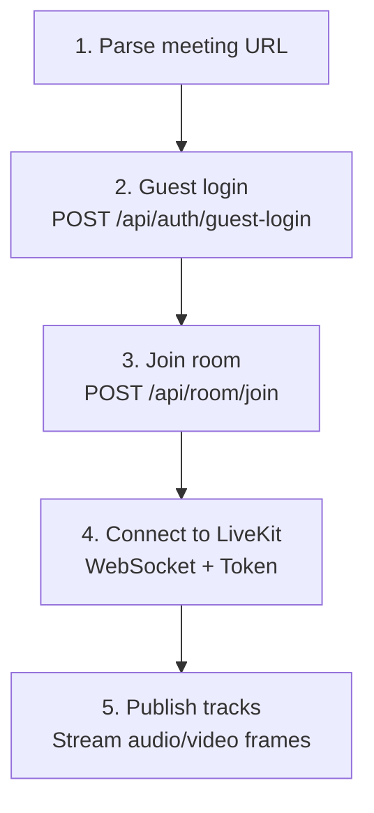
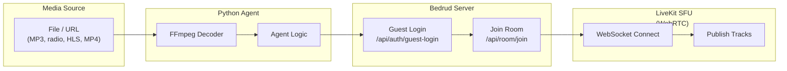

Bedrud, toplantı odalarına katılıp medya içeriği yayınlayabilen Python tabanlı bot aracıları içerir. Bunlar arka plan müziği, radyo yayınları veya video içeriği paylaşımı için kullanışlıdır.

## Kullanılabilir Aracılar

| Araç | Açıklama | Medya Türü |
|------|----------|------------|
| `music_agent` | Bir odada ses dosyalarını çalar | Ses (PCM) |
| `radio_agent` | İnternet radyo istasyonlarını yayınlar | Ses (FFmpeg ile PCM) |
| `video_stream_agent` | Video içeriği paylaşır (HLS, MP4) | Video + Ses |

## Aracılar Nasıl Çalışır

Tüm aracılar aynı bağlantı örüntüsünü izler:





## Müzik Aracısı

Bir toplantı odasında ses dosyalarını (MP3, WAV vb.) çalar.

### Kurulum

```bash
cd agents/music_agent
pip install -r requirements.txt
```

**Bağımlılıklar:** `httpx`, `livekit`, `pydub`

### Kullanım

```bash
python agent.py "https://meet.example.com/m/room-name"
```

### Nasıl Çalışır

1. `pydub` ile ses dosyalarını kod çözer
2. PCM karelerine dönüştürür
3. Ses karelerini bir mikrofon kanalı olarak LiveKit'e yayınlar

> Kurulum ve kullanım talimatları için bkz. [Müzik Aracısı README](https://github.com/bedrud-ir/bedrud/tree/main/agents/music_agent).

---

## Radyo Aracısı

Ses kod çözme için FFmpeg kullanarak internet radyo istasyonlarını bir toplantı odasına yayınlar.

### Kurulum

```bash
cd agents/radio_agent
pip install -r requirements.txt
```

**Bağımlılıklar:** `httpx`, `livekit`

**Sistem gereksinimi:** FFmpeg kurulu olmalıdır (`brew install ffmpeg` veya `apt install ffmpeg`)

### Kullanım

```bash
python agent.py "https://meet.example.com/m/room-name"
```

### Nasıl Çalışır

1. Bir radyo yayın URL'sine bağlanır
2. Yayını ham PCM'e kod çözmek için FFmpeg'den geçirir
3. PCM ses karelerini LiveKit'e yayınlar

> Kurulum ve kullanım talimatları için bkz. [Radyo Aracısı README](https://github.com/bedrud-ir/bedrud/tree/main/agents/radio_agent).

---

## Video Yayın Aracısı

Bir URL'den (HLS/m3u8, MP4) video ve sesi bir toplantı odasına paylaşır.

### Kurulum

```bash
cd agents/video_stream_agent
pip install -r requirements.txt
```

**Bağımlılıklar:** `httpx`, `livekit`

**Sistem gereksinimi:** FFmpeg kurulu olmalıdır

### Kullanım

```bash
python agent.py "https://meet.example.com/m/room-name"
```

### Nasıl Çalışır

1. Paralel olarak iki FFmpeg süreci çalıştırır:
    - **Video:** YUV420p ham karelere kod çözer (1280x720 @ 30fps)
    - **Ses:** PCM örneklerine kod çözer
2. Videoyu bir ekran paylaşımı kanalı olarak yayınlar
3. Sesi bir mikrofon kanalı olarak yayınlar

> Kurulum ve kullanım talimatları için bkz. [Video Yayın Aracısı README](https://github.com/bedrud-ir/bedrud/tree/main/agents/video_stream_agent).

### Video Özellikleri

| Ayar | Değer |
|------|-------|
| Genişlik | 1280 |
| Yükseklik | 720 |
| FPS | 30 |
| Piksel Biçimi | YUV420p |

---

## Özel Araç Yazma

Yeni bir araç oluşturmak için şu örüntüyü izleyin:

```python
import httpx
from livekit import rtc

# 1. Parse the meeting URL to extract room name
room_name = parse_url(meeting_url)

# 2. Guest login
client = httpx.Client(base_url=server_url)
resp = client.post("/api/auth/guest-login", json={"name": "Bot Name"})
token = resp.json()["token"]

# 3. Join room
client.headers["Authorization"] = f"Bearer {token}"
resp = client.post("/api/room/join", json={"roomName": room_name})
lk_token = resp.json()["token"]

# 4. Connect to LiveKit
room = rtc.Room()
await room.connect(livekit_url, lk_token)

# 5. Publish tracks
source = rtc.AudioSource(sample_rate=48000, num_channels=1)
track = rtc.LocalAudioTrack.create_audio_track("audio", source)
await room.local_participant.publish_track(track)

# 6. Stream frames
while has_data:
    frame = get_next_frame()
    await source.capture_frame(frame)
```

---

## Ayrıca bakınız

- [Müzik Aracısı README](https://github.com/bedrud-ir/bedrud/tree/main/agents/music_agent) - kurulum ve kullanım
- [Radyo Aracısı README](https://github.com/bedrud-ir/bedrud/tree/main/agents/radio_agent) - kurulum ve kullanım
- [Video Yayın Aracısı README](https://github.com/bedrud-ir/bedrud/tree/main/agents/video_stream_agent) - kurulum ve kullanım
