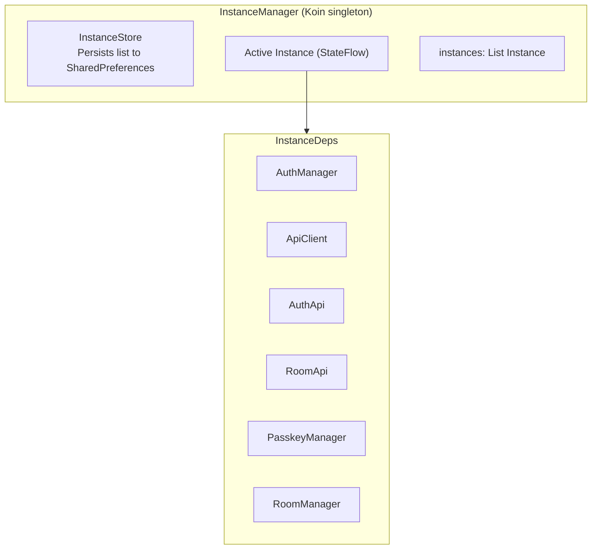
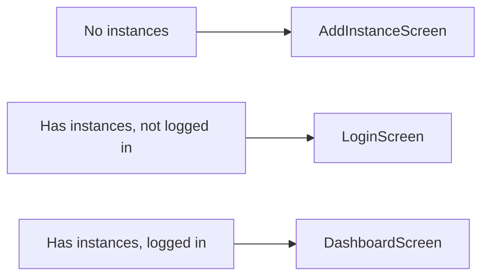

Bedrud Android uygulaması Jetpack Compose ve Kotlin ile oluşturulmuş olup, resim içinde resim, derin bağlantı ve çoklu örnek desteği ile yerel bir video toplantısı deneyimi sunar.

## Teknoloji Yığını

| Teknoloji | Sürüm | Amaç |
|-----------|-------|------|
| Kotlin | 2.1.0 | Dil |
| Jetpack Compose | Material 3 | UI araç takımı |
| Koin | 4.0.0 | Bağımlılık enjeksiyonu |
| Retrofit + OkHttp | En son | HTTP istemcisi |
| LiveKit Android SDK | 2.23.3 | WebRTC medya |
| Credentials API | En son | Passkey desteği |
| Encrypted SharedPreferences | En son | Güvenli depolama |
| Coil | En son | Görsel yükleme |

**Hedef:** Min SDK 28, Target SDK 35, JDK 17

## Dizin Yapısı

```
apps/android/app/src/main/java/com/bedrud/app/
├── BedrudApplication.kt           # Uygulama sınıfı (Koin başlatma)
├── MainActivity.kt                # Tek etkinlik giriş noktası
├── core/
│   ├── api/                       # Retrofit API istemcisi
│   │   ├── ApiClient.kt           # Auth yakalayıcılı temel HTTP istemcisi
│   │   ├── AuthApi.kt             # Auth uç nokta tanımları
│   │   └── RoomApi.kt             # Oda uç nokta tanımları
│   ├── auth/
│   │   └── AuthManager.kt         # Token yönetimi, giriş/çıkış
│   ├── call/
│   │   ├── CallService.kt         # Aramalar için ön plan servisi
│   │   └── CallConnectionService.kt  # Android ConnectionService
│   ├── deeplink/
│   │   └── DeepLinkHandler.kt     # bedrud.com derin bağlantılarını işleme
│   ├── di/
│   │   └── AppModule.kt           # Koin modülü tanımları
│   ├── instance/
│   │   ├── InstanceManager.kt     # Merkezi çoklu örnek düzenleyici
│   │   ├── InstanceStore.kt       # Kalıcı örnek depolama
│   │   └── InstanceDeps.kt        # Örnek başına bağımlılık konteyneri
│   ├── livekit/
│   │   └── RoomManager.kt         # LiveKit oda bağlantı yöneticisi
│   └── pip/
│       └── PipManager.kt          # Resim içinde resim denetleyicisi
├── models/
│   ├── User.kt                    # Kullanıcı veri modeli
│   ├── Room.kt                    # Oda veri modeli
│   ├── Instance.kt                # Sunucu örneği modeli
│   └── ApiResponse.kt             # API yanıt sarmalayıcıları
└── ui/
    ├── screens/
    │   ├── auth/
    │   │   ├── LoginScreen.kt     # E-posta/parola + passkey girişi
    │   │   └── RegisterScreen.kt  # Hesap kaydı
    │   ├── dashboard/
    │   │   └── DashboardScreen.kt # Oda listesi ve yönetimi
    │   ├── meeting/
    │   │   └── MeetingScreen.kt   # Görüntülü arama arayüzü
    │   ├── instance/
    │   │   ├── AddInstanceScreen.kt    # Sunucu örneği ekleme
    │   │   └── InstanceSwitcher.kt     # Örnekler arasında geçiş
    │   ├── profile/
    │   │   └── ProfileScreen.kt   # Kullanıcı profili
    │   └── settings/
    │       └── SettingsScreen.kt  # Uygulama ayarları
    ├── components/                 # Yeniden kullanılabilir Compose bileşenleri
    └── theme/                      # Material 3 tema tanımı
```

## Çoklu Örnek Mimarisi

Android uygulaması aynı anda birden fazla Bedrud sunucusuna bağlanmayı destekler.



### Temel Örüntü

Örnek başına tüm bağımlılıklar `InstanceManager` üzerinde `StateFlow<T?>` olarak sunulur. Composable'lar bunları toplar:

```kotlin
val authManager = instanceManager.authManager.collectAsState().value ?: return
val roomApi = instanceManager.roomApi.collectAsState().value ?: return
```

`?: return` örüntüsü composable'ın örnek tam olarak başlatılana kadar_RENDERLENMEMESİNİ sağlar.

### Gezinti Akışı



Örnek değiştirici Dashboard araç çubuğundan tetiklenen bir `ModalBottomSheet` olarak görünür.

## Özellikler

### Derin Bağlantı

Uygulama şu URL kalıplarını işler:

- `https://bedrud.com/m/*` - Doğrudan odaya katılma
- `https://bedrud.com/c/*` - Kod ile odaya katılma

`AndroidManifest.xml` dosyasındaki intent filtreleri ile yapılandırılır.

### Arama Yönetimi

- **CallService** - Aramalar sırasında bağlantıyı canlı tutan ön plan servisi
- **CallConnectionService** - Uygun arama arayüzü için Android'in telefon çerçevesiyle entegre olur
- Gerekli izinler: `MANAGE_OWN_CALLS`, `FOREGROUND_SERVICE_PHONE_CALL`, `FOREGROUND_SERVICE_CAMERA`, `FOREGROUND_SERVICE_MICROPHONE`

### Resim İçinde Resim

Toplantı ekranı PiP modunu destekler, kullanıcıların diğer uygulamaları kullanırken video yayını görmesine olanak tanır.

### Passkey

FIDO2/WebAuthn passkey kaydı ve girişi için Android'in Credentials API'sini kullanır.

## Derleme

```bash
# Hata ayıklama APK
make build-android-debug

# Sürüm APK (keystore.properties gerektirir)
make build-android

# Derle + bağlı cihaza yükle
make release-android

# Android Studio'da aç
make dev-android
```

### Sürüm İmzalama

Sürüm derlemeleri Android proje kökünde imzalama yapılandırmanızı içeren bir `keystore.properties` dosyası gerektirir.
