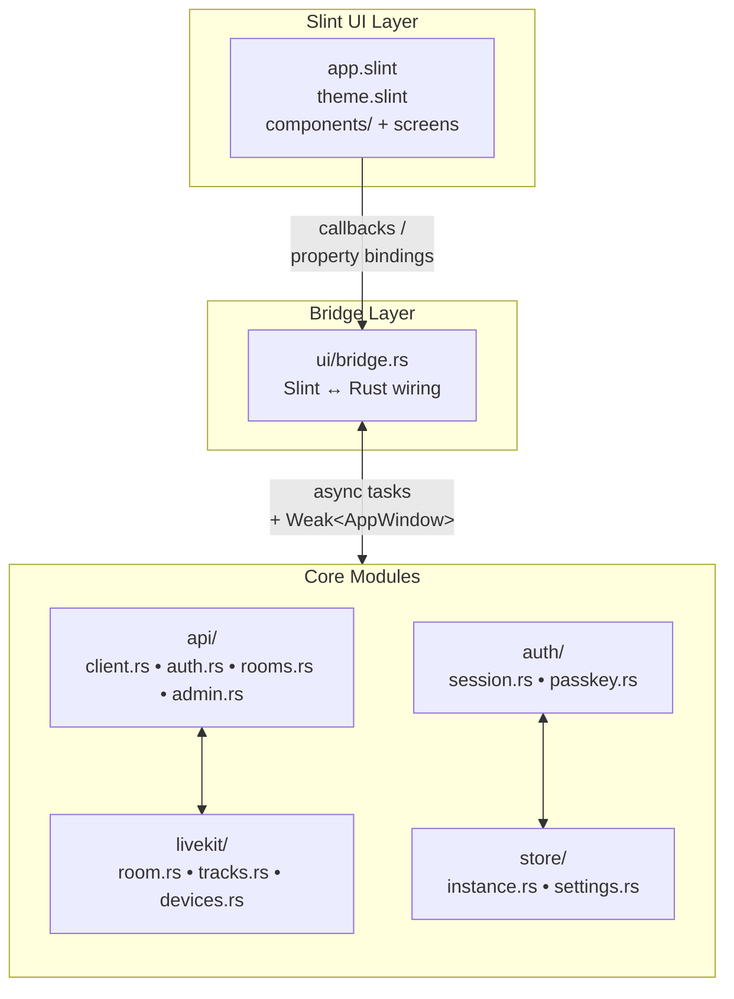

Bedrud masaüstü istemcisi; **Rust** ve **Slint** UI araç takımı ile oluşturulmuş yerel bir Windows ve Linux uygulamasıdır. Web ve mobil istemcilerle aynı temel toplantı deneyimini sunar, herhangi bir çalışma zamanı bağımlılığı olmadan tek bir ikili dosyaya derlenir.

## Teknoloji Yığını

| Bileşen | Teknoloji |
|---------|-----------|
| Dil | Rust (stable) |
| UI araç takımı | Slint 1.x |
| HTTP istemcisi | reqwest (async, TLS) |
| Medya | LiveKit Rust SDK |
| Depolama | serde_json + OS keyring (libsecret / Windows Credential Store) |
| Derleme sistemi | Cargo workspace |

## Platform Desteği

| Platform | İşleyici | İkili Dosya |
|----------|----------|-------------|
| Windows 10/11 | Direct3D 11 | `bedrud-desktop.exe` |
| Linux x86_64 | OpenGL / Vulkan (EGL/Wayland/X11 ile) | `bedrud-desktop` |
| macOS | _(henüz yok - web uygulamasını kullanın)_ | - |

## Kaynak Düzeni

```
apps/desktop/
├── Cargo.toml              # Crate tanımı
├── build.rs                # Slint derleme adımı
├── src/
│   ├── main.rs             # Giriş noktası - uygulamayı başlatır + olay döngüsü
│   ├── app.rs              # Üst düzey AppState ve başlangıç mantığı
│   ├── api/
│   │   ├── client.rs       # Paylaşılan HTTP istemcisi (temel URL, JWT ekleme)
│   │   ├── auth.rs         # Giriş, kayıt, yenileme
│   │   ├── rooms.rs        # Oda listesi, katılma, oluşturma
│   │   └── admin.rs        # Yönetici uç noktaları
│   ├── auth/
│   │   ├── session.rs      # JWT depolama ve yenileme döngüsü
│   │   └── passkey.rs      # FIDO2 passkey taslağı
│   ├── livekit/
│   │   ├── room.rs         # Oda bağlantı yaşam döngüsü
│   │   ├── tracks.rs       # Ses/video kanalı yönetimi
│   │   └── devices.rs      # Mikrofon / kamera numaralandırma
│   ├── store/
│   │   ├── instance.rs     # Çoklu örnek kalıcılığı
│   │   └── settings.rs     # Kullanıcı tercihleri
│   └── ui/
│       ├── mod.rs
│       └── bridge.rs       # Slint ↔ Rust geri çağrı bağlantısı
└── ui/
    ├── app.slint            # Kök bileşen, sayfa yönlendirici
    ├── theme.slint          # Renkler, tipografi, boşluk tokenları
    ├── components/          # Button, Input, Card, Avatar
    ├── auth/                # Giriş ve Kayıt ekranları
    ├── dashboard/           # Oda listesi, Oda oluşturma iletişim kutusu
    ├── meeting/             # Kontroller çubuğu, katılımcı karoları, sohbet
    ├── admin/               # Yönetici paneli, kullanıcı tablosu
    └── settings.slint       # Ayarlar ekranı
```

## Mimari



### Temel tasarım kararları

- **Slint'in derleme zamanı UI'sı** - `.slint` dosyaları `build.rs` aracılığıyla derleme zamanında Rust'a derlenir. Çalışma zamanında bir düzen motoru yoktur; UI tamamen yereldir.
- **`bridge.rs` tek UI↔mantık sınırı olarak** - tüm Slint geri çağrıları tek bir yerde bağlanır, iş mantığını UI katmanının dışında tutar ve köprüyü denetlemeyi kolaylaştırır.
- **Geri çağrılarda `Weak<AppWindow>`** - Slint UI tanıtıcıları `!Send` olduğundan, arka plan görevleri özellikleri ayarlamak için tanıtıcıyı iş parçacıkları arasında paylaşmak yerine UI iş parçacığında saklanan bir `Weak` referansını yükseltir.
- **`store/instance.rs` ile çoklu örnek** - mobil uygulamalarla aynı şekilde: örnekler OS yapılandırma dizinindeki bir JSON dosyasına serileştirilir; her örneğin kendi `APIClient` ve `AuthSession`'ı vardır.

## Yerel Olarak Derleme

### Ön Koşullar

- Rust stable araç zinciri (`rustup toolchain install stable`)
- **Linux:** `libfontconfig`, `libxkbcommon`, `libwayland`, `libgles2`, `libdbus`, `libsecret`

  ```bash
  sudo apt-get install -y \
    libfontconfig1-dev libxkbcommon-dev libxkbcommon-x11-dev \
    libwayland-dev libgles2-mesa-dev libegl1-mesa-dev \
    libdbus-1-dev libsecret-1-dev \
    libasound2-dev
  ```

- **Windows:** C++ iş yükü ile Visual Studio Build Tools (MSVC)

### Derleme

```bash
# Hata ayıklama derlemesi (hızlı derleme, iyileştirmesiz)
make dev-desktop          # derlemeden hemen sonra uygulamayı çalıştırır

# Sürüm derlemesi
make build-desktop        # → target/release/bedrud-desktop (Linux)
                           # → target/release/bedrud-desktop.exe (Windows)
```

Veya doğrudan Cargo ile:

```bash
cargo build -p bedrud-desktop                          # hata ayıklama
cargo build -p bedrud-desktop --release                # iyileştirilmiş
cargo run   -p bedrud-desktop                          # hemen çalıştır
```

## CI

Masaüstü uygulaması `main` dalına her gönderimde ve pull request'lerde CI'da derlenir:

| İş | Çalıştırıcı | Ne denetler |
|-----|-------------|-------------|
| `Desktop – Build & Test` | `ubuntu-latest` | `cargo build`, `cargo test` |

Sürüm derlemeleri iki artefakt üretir:

| Artefakt | Çalıştırıcı | Biçim |
|----------|-------------|-------|
| `bedrud-desktop-linux-x86_64.tar.xz` | `ubuntu-latest` | tar.xz |
| `bedrud-desktop-windows-x86_64.zip` | `windows-latest` | zip |
