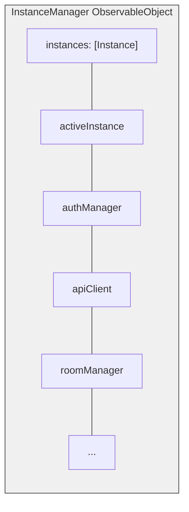
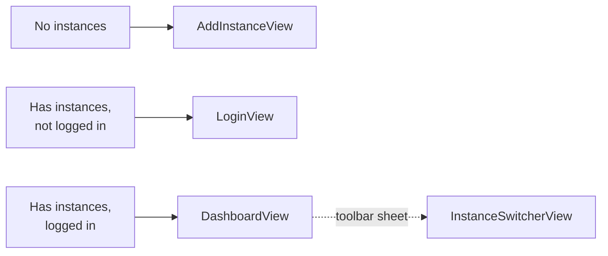

Bedrud iOS uygulaması SwiftUI ile oluşturulmuş olup, çoklu örnek desteği ve güvenli kimlik bilgisi depolama ile yerel bir video toplantısı deneyimi sunar.

## Teknoloji Yığını

| Teknoloji | Sürüm | Amaç |
|-----------|-------|------|
| Swift | 5.9+ | Dil |
| SwiftUI | En son | UI çerçevesi |
| LiveKit Swift SDK | 2.0+ | WebRTC medya |
| KeychainAccess | 4.2.2+ | Güvenli kimlik bilgisi depolama |

**Dağıtım hedefi:** iOS 18.0

## Proje Yapılandırması

Proje `project.yml` dosyasından proje üretimi için **XCodeGen** kullanır:

- Bundle ID: `com.bedrud.ios`
- Üretim komutu: `xcodegen generate`

## Dizin Yapısı

```text
apps/ios/Bedrud/
├── BedrudApp.swift                # Uygulama giriş noktası
├── Core/
│   ├── API/
│   │   └── APIClient.swift        # URLSession tabanlı REST istemcisi
│   ├── Auth/
│   │   └── AuthManager.swift      # Token yönetimi, giriş/çıkış
│   ├── Instance/
│   │   ├── InstanceManager.swift  # Merkezi çoklu örnek düzenleyici
│   │   └── InstanceStore.swift    # Kalıcı örnek depolama (UserDefaults)
│   └── LiveKit/
│       └── RoomManager.swift      # LiveKit oda bağlantı yöneticisi
├── Features/
│   ├── Auth/
│   │   ├── LoginView.swift        # Giriş ekranı
│   │   └── RegisterView.swift     # Kayıt ekranı
│   ├── Dashboard/
│   │   └── DashboardView.swift    # Oda listesi ve yönetimi
│   ├── Meeting/
│   │   └── MeetingView.swift      # Görüntülü arama arayüzü
│   ├── Profile/
│   │   └── ProfileView.swift      # Kullanıcı profili
│   ├── Instance/
│   │   ├── AddInstanceView.swift  # Sunucu örneği ekleme
│   │   └── InstanceSwitcherView.swift  # Örnekler arasında geçiş
│   ├── Settings/
│   │   └── SettingsView.swift     # Uygulama ayarları
│   ├── JoinByURL/
│   │   └── JoinByURLView.swift    # Derin bağlantı işleme
│   └── Main/
│       └── MainTabView.swift      # Sekme gezintisi
├── Models/
│   ├── User.swift
│   ├── Room.swift
│   └── Instance.swift
└── Design/
    └── Components/                # Yeniden kullanılabilir SwiftUI bileşenleri
```

## Çoklu Örnek Mimarisi

iOS uygulaması çoklu örnek desteği için Android mimarisini yansıtır.



### Temel Örüntü

Bağımlılıklar bir `ObservableObject` olan `InstanceManager` üzerinde `@Published` özellikleridir. Görünümler bunları `@EnvironmentObject` ile alır:

```swift
struct DashboardView: View {
    @EnvironmentObject var instanceManager: InstanceManager

    var body: some View {
        if let authManager = instanceManager.authManager {
            // Render authenticated UI
        }
    }
}
```

### Gezinti Akışı



Örnek değiştirici Dashboard araç çubuğundan tetiklenen bir `.sheet` olarak görünür.

## Uygulama Giriş Noktası

`BedrudApp.swift` çekirdek servisleri başlatır ve bunları SwiftUI ortamına enjekte eder:

```swift
@main
struct BedrudApp: App {
    @StateObject var instanceStore = InstanceStore()
    @StateObject var instanceManager = InstanceManager()
    @StateObject var settingsStore = SettingsStore()

    var body: some Scene {
        WindowGroup {
            ContentView()
                .environmentObject(instanceStore)
                .environmentObject(instanceManager)
                .environmentObject(settingsStore)
        }
    }
}
```

## Özellikler

### Güvenli Depolama

JWT tokenları ve hassas kimlik bilgileri UserDefaults yerine **KeychainAccess** ile saklanır.

### Derin Bağlantı

Doğrudan odaya katılma ve oda kodları için URL'leri işler.

### Ayarlar

Kullanıcı tercihleri `SettingsStore` üzerinden UserDefaults kullanılarak kalıcı olarak saklanır.

## Derleme

```bash
# Xcode'da aç
make dev-ios

# Arşiv derle (Sürüm)
make build-ios

# IPA dışa aktar (ExportOptions.plist gerektirir)
make export-ios

# Simülatör için derle (Hata Ayıklama)
make build-ios-sim
```

### Gereksinimler

- Xcode (en son kararlı sürüm)
- iOS 18.0 dağıtım hedefi
- Cihaz derlemeleri için: Apple Developer hesabı ve sağlama profili
