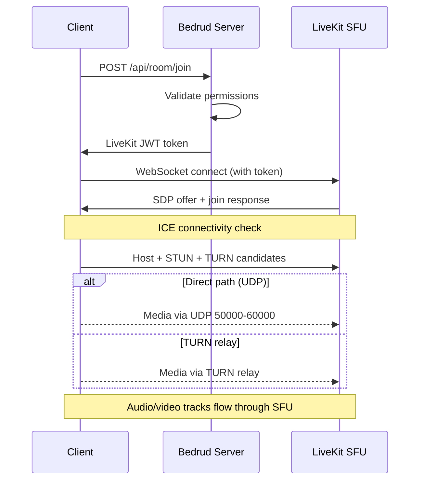

Bedrud; bir Go sunucusu, üç istemci uygulaması, Python bot aracıları ve ortak paketler içeren bir monorepo'dur. Bu sayfa bileşenlerin birbiriyle nasıl ilişkili olduğunu açıklar.

## Üst Düzey Diyagram

```
┌──────────────────────────────────────────────────────────────┐
│                          Clients                             │
│                                                              │
│  ┌─────────┐  ┌──────────┐  ┌────────┐  ┌───────────────┐   │
│  │  Web    │  │ Android  │  │  iOS   │  │ Desktop       │   │
│  │ React   │  │ Compose  │  │SwiftUI │  │ Rust + Slint  │   │
│  └────┬────┘  └────┬─────┘  └───┬────┘  └──────┬────────┘   │
│       │            │            │              │             │
│       └────────────┼────────────┼──────────────┘             │
│                    │                                         │
│               REST API + WebSocket                          │
└────────────────────┼────────────────────────────────────────┘
                           │
┌────────────────────────┼────────────────────────────────┐
│                   Bedrud Server                         │
│                        │                                │
│  ┌─────────────────────┴──────────────────────────┐     │
│  │              Fiber HTTP Router                  │     │
│  │  /api/auth/*  /api/room/*  /api/admin/*        │     │
│  └──────────┬─────────────────────┬───────────────┘     │
│             │                     │                     │
│  ┌──────────┴──────────┐  ┌──────┴────────────────┐     │
│  │   GORM / SQLite     │  │  LiveKit Protocol SDK │     │
│  │   (or PostgreSQL)   │  │  (token generation,   │     │
│  │                     │  │   room management)    │     │
│  └─────────────────────┘  └──────────┬────────────┘     │
│                                      │                  │
│                           ┌──────────┴────────────┐     │
│                           │  Embedded LiveKit      │     │
│                           │  Media Server (WebRTC) │     │
│                           └───────────────────────┘     │
└─────────────────────────────────────────────────────────┘
```

## Bileşenler

### Sunucu (`server/`)

Go arka ucu Bedrud'un çekirdeğidir. Şunları yönetir:

- **REST API** - kimlik doğrulama, oda yönetimi, yönetici işlemleri
- **Statik dosya sunumu** - derlenmiş web ön ucu `//go:embed` ile gömülüdür
- **LiveKit entegrasyonu** - LiveKit Protocol SDK üzerinden token üretir ve odaları yönetir
- **Gömülü LiveKit sunucusu** - medya sunucusu ikili dosyası bir alt süreç olarak çalışır

Sunucu **Fiber** web çerçevesini (Node.js'deki Express.js'e benzer) ve ORM katmanı olarak **GORM**'u kullanır. Geliştirme için SQLite, üretim için PostgreSQL destekler.

Ayrıntılar için bkz. [Sunucu Mimarisi](/tr/docs/architecture/server).

### Web Ön Ucu (`apps/web/`)

TanStack Start, TailwindCSS v4 ve shadcn/ui ile oluşturulmuş bir **React** uygulamasıdır. Üretimde sunucuda ön_RENDERLENİR ve istemci varlıkları Go ikili dosyasına gömülür.

Temel yetenekler:

- LiveKit Client SDK ile video toplantısı arayüzü
- Otomatik token yenileme ile JWT tabanlı kimlik doğrulama
- Kullanıcı ve oda yönetimi için yönetici paneli
- Tutarlı bileşen kütüphanesi ile tasarım sistemi

Ayrıntılar için bkz. [Web Ön Ucu](/tr/docs/architecture/web).

### Android Uygulaması (`apps/android/`)

**Jetpack Compose** ve **Kotlin** ile oluşturulmuş yerel bir Android uygulamasıdır. Bağımlılık enjeksiyonu için Koin, HTTP için Retrofit kullanır.

Temel yetenekler:

- LiveKit Android SDK ile tam video toplantısı deneyimi
- Resim içinde resim (PiP) modu
- Derin bağlantı işleme (`bedrud.com/m/*` ve `bedrud.com/c/*`)
- Android ConnectionService ile arama yönetimi
- Çoklu örnek desteği (birden fazla sunucuya bağlanma)

Ayrıntılar için bkz. [Android Uygulaması](/tr/docs/architecture/android).

### iOS Uygulaması (`apps/ios/`)

**SwiftUI** ile oluşturulmuş yerel bir iOS uygulamasıdır. Güvenli kimlik bilgisi depolama için KeychainAccess, medya için LiveKit Swift SDK kullanır.

Temel yetenekler:

- Tam video toplantısı deneyimi
- Çoklu örnek desteği
- Derin bağlantı işleme
- Keychain tabanlı güvenli depolama

Ayrıntılar için bkz. [iOS Uygulaması](/tr/docs/architecture/ios).

### Masaüstü Uygulaması (`apps/desktop/`)

**Rust** ve **Slint** UI araç takımı ile oluşturulmuş yerel bir Windows ve Linux masaüstü uygulamasıdır. Herhangi bir çalışma zamanı bağımlılığı olmadan tek bir ikili dosyaya derlenir.

Temel yetenekler:

- LiveKit Rust SDK ile tam video toplantısı deneyimi
- Yerel Windows (Direct3D 11) ve Linux (OpenGL/Vulkan) işleme
- Çoklu örnek desteği (birden fazla Bedrud sunucusuna bağlanma)
- Güvenli kimlik bilgisi depolama için OS keyring entegrasyonu

Ayrıntılar için bkz. [Masaüstü Uygulaması](/tr/docs/architecture/desktop).

### Bot Aracıları (`agents/`)

Toplantı odalarına bot olarak katılan ve medya içeriği yayınlayan Python betikleri:

- **Müzik Aracısı** - ses dosyalarını çalar
- **Radyo Aracısı** - internet radyo istasyonlarını yayınlar
- **Video Yayın Aracısı** - video içeriği paylaşır (HLS, MP4)

Ayrıntılar için bkz. [Bot Aracıları](/tr/docs/architecture/agents).

## Kimlik Doğrulama Akışı

```
Client                    Server                    Database
  │                         │                          │
  ├─POST /api/auth/login───►│                          │
  │                         ├──verify credentials─────►│
  │                         │◄─────────────────────────┤
  │◄──access + refresh JWT──┤                          │
  │                         │                          │
  ├─GET /api/room/list──────►│  (Authorization header)  │
  │  (Bearer <access_token>)│                          │
  │◄──room list─────────────┤                          │
```

Tüm kimlik doğrulaması yapılmış istekler `Authorization` başlığında JWT tokenları kullanır. Web ön ucundaki `authFetch` sarmalayıcısı token ekleme ve otomatik yenileme işlemlerini gerçekleştirir.

Desteklenen kimlik doğrulama yöntemleri:

| Yöntem | Uç Nokta | Açıklama |
|--------|----------|----------|
| E-posta/Parola | `POST /api/auth/login` | Geleneksel kimlik bilgileri |
| Kayıt | `POST /api/auth/register` | Yeni hesap oluşturma |
| Misafir | `POST /api/auth/guest-login` | Sadece isimle geçici erişim |
| OAuth | `GET /api/auth/:provider/login` | Google, GitHub, Twitter |
| Passkey | `POST /api/auth/passkey/*` | FIDO2/WebAuthn biyometrisi |

## Toplantı Bağlantı Akışı



1. İstemci REST API üzerinden bir odaya katılma isteği gönderir
2. Sunucu izinleri doğrular ve imzalı bir LiveKit tokenı üretir
3. İstemci bu tokenı kullanarak WebSocket üzerinden doğrudan LiveKit'e bağlanır
4. ICE adayları toplar (host, STUN, TURN) ve en iyi yolu seçer
5. Ses/video kanalları LiveKit'in SFU'sundan geçer

Tam bağlantı yığını için bkz. [WebRTC Bağlantısı](/tr/docs/architecture/webrtc-connectivity).

## Veri Modeli

### User

| Alan | Tür | Açıklama |
|------|-----|----------|
| ID | uint | Birincil anahtar |
| Email | string | Benzersiz e-posta adresi |
| Name | string | Görünen ad |
| Password | string | Karmalanmış parola (OAuth/misafir için boş) |
| Avatar | string | Avatar URL'si |
| Provider | string | Kimlik doğrulama sağlayıcısı (`local`, `google`, `github`, `twitter`, `guest`) |
| Role | string | `user` veya `admin` |

### Room

| Alan | Tür | Açıklama |
|------|-----|----------|
| ID | uint | Birincil anahtar |
| AdminID | uint | Dış anahtar → User.ID (oda oluşturan) |
| Name | string | Oda adı / URL kısa adı |
| IsPublic | bool | Misafirlerin davetsiz katılıp katılamayacağı |
| ChatEnabled | bool | Oda içi sohbetin aktif olup olmadığı |
| VideoEnabled | bool | Videoya izin verilip verilmediği |
| Participants | []User | Odada bulunan kullanıcılar |

### Passkey

| Alan | Tür | Açıklama |
|------|-----|----------|
| ID | uint | Birincil anahtar |
| UserID | uint | Dış anahtar → User.ID |
| CredentialID | []byte | WebAuthn kimlik bilgisi ID'si |
| PublicKey | []byte | WebAuthn ortak anahtarı |
| Counter | uint32 | WebAuthn imza sayacı |

### RefreshToken

| Alan | Tür | Açıklama |
|------|-----|----------|
| Token | string | Yenileme tokenı metni |
| UserID | uint | Dış anahtar → User.ID |
| ExpiresAt | time | Token son kullanma zaman damgası |

## Dağıtım Mimarisi

Üretimde Bedrud iki systemd hizmeti olarak çalışır:

| Hizmet | İkili Dosya | Amaç |
|--------|-------------|------|
| `bedrud.service` | `bedrud --run` | API sunucusu + gömülü web ön ucu |
| `livekit.service` | `bedrud --livekit` | WebRTC medya sunucusu |

İkisi de tek bir ikili dosya tarafından yönetilir. Traefik veya başka bir ters vekil TLS sonlandırmasını ve trafik yönlendirmeyi gerçekleştirir.

Kurulum talimatları için bkz. [Dağıtım Kılavuzu](/tr/docs/guides/deployment).

## Temel Terimler

Bu terimler mimari belgelerinde genel olarak kullanılır:

| Terim | Tam Adı | Anlamı |
|-------|---------|--------|
| **SFU** | Selective Forwarding Unit | Her katılımcıdan yayınları alıp diğerlerine ileten bir medya sunucusudur. İstemciler birbirine değil sunucuya bağlanır. |
| **SDP** | Session Description Protocol | WebRTC bağlantı parametrelerini (kodekler, çözünürlükler, medya türleri) tanımlamak için kullanılan biçim. |
| **ICE** | Interactive Connectivity Establishment | İstemci ve sunucu arasındaki tüm olası ağ yollarını toplayıp en iyisini seçen bir çerçeve. |
| **STUN** | Session Traversal Utilities for NAT | İstemcinin genel IP adresini keşfetmesine yardımcı olan hafif bir protokol. Çoğu bağlantıda çalışır. |
| **TURN** | Traversal Using Relays around NAT | Doğrudan bağlantı mümkün olmadığında tüm medyayı sunucu üzerinden aktaran bir protokol. Son çare, en yüksek bant genişliği maliyeti. |
| **NAT** | Network Address Translation | Özel iç adresleri bir genel adrese eşleyen bir yönlendirici özelliği. Türüne göre doğrudan WebRTC bağlantılarını engelleyebilir. |
| **srflx** | Server Reflexive | İstemcinin STUN aracılığıyla keşfedilen genel IP'sini temsil eden ICE adayı türü. |
| **WebRTC** | Web Real-Time Communication | Gerçek zamanlı ses, video ve veri aktarımı için tarayıcı ve mobil API standardı. |

## Ayrıca Bakınız

- [WebRTC Bağlantısı](/tr/docs/architecture/webrtc-connectivity) - tam STUN/ICE/TURN/SFU bağlantı yığını
- [TURN Sunucusu Kılavuzu](/tr/docs/architecture/turn-server) - TURN aktarma mimarisi ve yapılandırması
- [LiveKit Entegrasyonu](/tr/docs/backend/livekit) - Bedrud'un LiveKit'i nasıl gömdüğü
