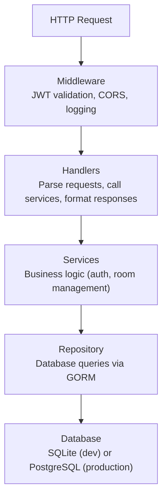

Bedrud sunucusu; REST API sağlayan, gömülü web ön ucunu sunan ve LiveKit medya sunucusunu yöneten bir Go uygulamasıdır.

## Teknoloji Yığını

| Teknoloji | Amaç |
|-----------|------|
| Go 1.24 | Temel dil |
| Fiber v2 | Web çerçevesi (Express benzeri) |
| GORM | SQLite ve PostgreSQL için ORM |
| LiveKit Protocol SDK | WebRTC oda ve token yönetimi |
| Zerolog | Yapılandırılmış JSON günlüklemesi |
| Goth | Çoklu sağlayıcı OAuth2 |
| go-passkeys | FIDO2/WebAuthn desteği |
| golang-jwt | JWT token oluşturma ve doğrulama |
| gocron | Arka plan iş planlaması |
| Swagger (swaggo) | API belgeleri oluşturma |

## Dizin Yapısı

```
server/
├── cmd/
│   ├── server/main.go        # Geliştirme giriş noktası
│   └── bedrud/main.go        # Üretim giriş noktası (install/livekit bayrakları ile)
├── internal/
│   ├── auth/                  # Kimlik doğrulama servisleri
│   │   ├── auth.go            # Temel auth servisi (kayıt, giriş, OAuth)
│   │   ├── jwt.go             # JWT token oluşturma ve doğrulama
│   │   └── session_store.go   # OAuth durumu için Gorilla oturum deposu
│   ├── database/              # Veritabanı başlatma ve geçişler
│   ├── handlers/              # HTTP istek işleyicileri (denetleyici katmanı)
│   │   ├── auth_handler.go    # Auth uç noktaları
│   │   ├── room.go            # Oda uç noktaları
│   │   └── users.go           # Kullanıcı yönetimi uç noktaları
│   ├── middleware/             # Fiber ara katmanı
│   │   └── auth.go            # JWT doğrulama, izin kontrolleri
│   ├── models/                # GORM modelleri (veritabanı şemaları)
│   │   ├── user.go            # Kullanıcı modeli
│   │   ├── room.go            # Oda modeli
│   │   └── passkey.go         # Passkey modeli
│   ├── repository/            # Veri erişim katmanı (GORM ile SQL)
│   │   ├── user_repository.go
│   │   ├── room_repository.go
│   │   └── passkey_repository.go
│   ├── livekit/               # Gömülü LiveKit sunucusu yönetimi
│   ├── scheduler/             # Arka plan iş planlaması
│   └── utils/                 # TLS ve diğer yardımcı araçlar
├── frontend/                  # Gömülü web ön ucu (derleme zamanında doldurulur)
├── config.yaml                # Geliştirme yapılandırması
├── livekit.yaml               # Geliştirme LiveKit yapılandırması
├── go.mod
└── go.sum
```

## Katmanlı Mimari

Sunucu üç katmanlı bir mimari izler:



## Temel Örüntüler

### Gömülü Ön Uç

Web ön ucu statik dosyalara derlenir ve `//go:embed` kullanılarak Go ikili dosyasına gömülür:

```go
//go:embed frontend/*
var frontendFS embed.FS
```

Derleme zamanında `bun run build:embed`, React uygulamasını SSR ile ön_RENDERLER ve `dist/client/` klasörünü `server/frontend/` içine kopyalar. Go derleyicisi daha sonra bunu ikili dosyaya dahil eder. Fiber sunucusu API olmayan tüm yollar için bu dosyaları sunar.

### JWT Kimlik Doğrulama

Ara katman JWT'yi `Authorization: Bearer <token>` başlığından çıkarır, doğrular ve istek üzerine kullanıcı bağlamını ekler. Korumalı yollar kullanıcı rollerini denetlemek için `RequireAccess` ara katmanını kullanır.

### LiveKit Token Üretimi

Bir kullanıcı odaya katıldığında sunucu:

1. Oda izinlerini doğrular
2. API gizli anahtarı ile imzalı bir LiveKit erişim tokenı oluşturur
3. Tokenı istemciye döndürür
4. İstemci bu tokenı kullanarak doğrudan LiveKit'e bağlanır

### Swagger Belgeleri

API belgeleri swaggo kullanılarak kod ek açıklamalarından otomatik olarak oluşturulur. Geliştirme ortamında `/api/swagger/` adresinden erişilebilir.

## Veritabanı

### SQLite (Varsayılan)

Geliştirme ve küçük dağıtımlar için Bedrud SQLite kullanır. Veritabanı dosyası yapılandırılan `database.path` konumunda saklanır (varsayılan: `data.db`).

### PostgreSQL

Daha yüksek eşzamanlılık gerektiren üretim ortamları için bir PostgreSQL bağlantı dizesi yapılandırın. GORM her iki diyalekti de şeffaf şekilde yönetir.

### Geçişler

GORM başlangıçta model yapılarına göre şemayı otomatik olarak geçirir. Modeller `internal/models/` dizininde tanımlanır.

## Arka Plan İşleri

`gocron` planlayıcısı şu periyodik görevleri çalıştırır:
- Süresi dolmuş yenileme tokenlarını temizleme
- Eski oda katılımcılarını kaldırma

---

## Ayrıca bakınız

- [Arka Uç Kod Yapısı](/tr/docs/backend/structure) - dizin haritası ve kodlama standartları
- [API İşleyicileri](/tr/docs/backend/api-handlers) - yönlendirme ve istek yaşam döngüsü
- [Veritabanı ve Modeller](/tr/docs/backend/database) - GORM modelleri ve repository örüntüsü
- [Kimlik Doğrulama Akışı](/tr/docs/backend/authentication) - JWT, OAuth ve passkey iç işleyişi
