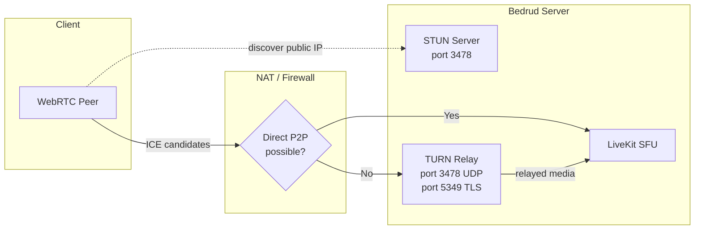
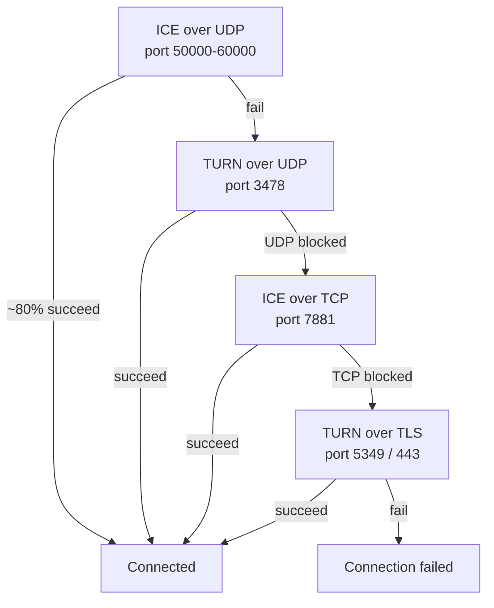
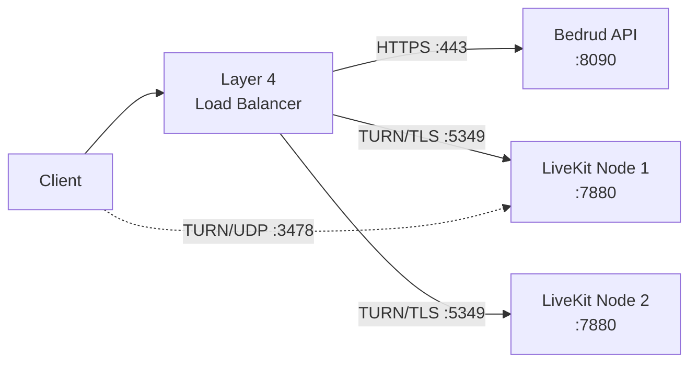
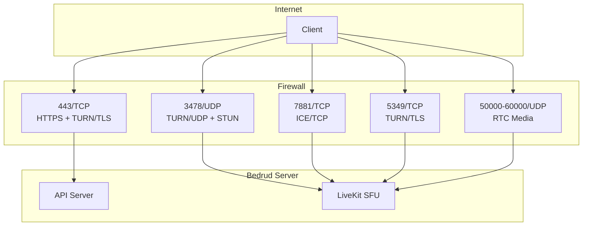

Bedrud, kısıtlayıcı NAT'ler veya güvenlik duvarları arkasındaki istemciler için medyayı aktarmak üzere LiveKit aracılığıyla gömülü bir TURN sunucusu barındırır. Bu sayfa mimariyi, yapılandırmayı ve sorun gidermeyi kapsar.

---

## TURN Nedir

**TURN** (Traversal Using Relays around NAT), iki uç nokta doğrudan bağlanamadığında medya paketlerini bir sunucu üzerinden ileten bir protokoldür.

**İlgili protokoller:**

| Protokol | Rol | Maliyet |
|----------|-----|---------|
| **STUN** | Genel IP/port keşfi. Hafif. | Yok (sunucu yalnızca küçük bağlama isteklerini görür) |
| **ICE** | Tüm bağlantı seçeneklerini öncelik sırasıyla deneyen çerçeve. | Yok (yalnızca koordinasyon) |
| **TURN** | Doğrudan yol başarısız olduğunda tüm medyayı aktarır. Son çare. | Yüksek (sunucu bant genişliği = tüm aktarılan medya) |

Tam bağlantı yığını için bkz. [WebRTC Bağlantısı](/tr/docs/architecture/webrtc-connectivity).

---

## Bedrud'da TURN

LiveKit gömülü bir TURN sunucusu içerir. Harici altyapı gerekmez.

### Aktarma Mimarisi



### Bağlantı Önceliği

LiveKit bağlantı türlerini sırayla dener. Her geri düşüş gecikme ve sunucu maliyeti ekler:



| Öncelik | Tür | Port | Tipik senaryo |
|----------|-----|------|---------------|
| 1 | ICE/UDP (doğrudan) | 50000-60000 | Çoğu bağlantı. Aktarma yok. |
| 2 | TURN/UDP | 3478 | Simetrik NAT, P2P engelli. |
| 3 | ICE/TCP | 7881 | UDP engelli (VPN, bazı güvenlik duvarları). |
| 4 | TURN/TLS | 5349 veya 443 | Kurumsal güvenlik duvarı, yalnızca HTTPS giden. |

---

## TURN Ne Zaman Aktifleşir

TURN, doğrudan medya yolu başarısız olduğunda aktifleşir. Yaygın nedenler:

- **Her iki uçta simetrik NAT** - İstemci ve sunucunun ikisinin de Simetrik NAT'i vardır. NAT her hedef için farklı bir genel port atar, bu nedenle STUN ile keşfedilen adres erişilemez olur.
- **Kurumsal güvenlik duvarı** - Giden UDP'yi tamamen engeller. Yalnızca TCP 443 portuna izin verilir.
- **VPN kısıtlamaları** - Bazı VPN'ler WebRTC trafiğini yakalar veya engeller.
- **Genel IP'siz bulut VM'leri** - Bazı bulut sağlayıcıları doğrudan ICE'yi bozan NAT kullanır.

Çoğu kullanıcı (~%80) hiçbir zaman TURN'e düşmez. Doğrudan UDP yolu çalışır.

### Bant Genişliği Maliyeti

TURN aktardığında sunucu o katılımcının tüm medyasını taşır. Yaklaşık yayın başına bant genişliği:

| Yayın türü | Bit hızı | Aktarılan katılımcı başına |
|-------------|----------|---------------------------|
| Ses (Opus) | ~32 Kbps | ~32 Kbps |
| Video 720p (VP8) | ~1.5 Mbps | Abone olunan kanal başına ~1.5 Mbps yükleme + 1.5 Mbps indirme |
| Ekran paylaşımı 1080p | ~2.5 Mbps | ~2.5 Mbps |

Bir aktarılan katılımcının bulunduğu 5 kişilik bir toplantıda: sunucu o katılımcının video aktarma için ~1.5 Mbps fazladan işler. Toplam sunucu bant genişliğini tahmin etmek için bu değerleri aktarılan katılımcı sayısıyla çarpın.

---

## Yapılandırma

**Dosya:** `server/config/livekit.yaml` (geliştirme) veya `/etc/bedrud/livekit.yaml` (üretim)

```yaml
turn:
  enabled: true
  domain: "turn.example.com"
  udp_port: 3478
  tls_port: 5349
  cert_file: /etc/bedrud/turn.crt
  key_file: /etc/bedrud/turn.key
  relay_range_start: 30000
  relay_range_end: 40000
  external_tls: false
```

### Anahtar Başvurusu

| Anahtar | Varsayılan | Açıklama |
|--------|------------|----------|
| `enabled` | `true` | Gömülü TURN sunucusunu etkinleştir. |
| `domain` | `localhost` | İstemcilere duyurulan etki alanı. Sunucunun genel IP'sine çözümlenmelidir. |
| `udp_port` | `3478` | TURN/UDP portu. TURN etkinleştirildiğinde STUN bağlama isteklerini de sunar. |
| `tls_port` | `5349` | TURN/TLS portu. Yük dengeleyici TLS'yi sonlandırmıyorsa `443` olarak ayarlayın. |
| `cert_file` | - | TURN/TLS için TLS sertifikası. TURN/TLS istemcileri olduğunda gereklidir. |
| `key_file` | - | `cert_file` ile eşleşen TLS özel anahtarı. |
| `relay_range_start` | `30000` | Aktarılan medya paketleri için kullanılan UDP port aralığının başlangıcı. |
| `relay_range_end` | `40000` | Aktarma port aralığının sonu. Her aktarılan katılımcı bu aralıktan port tüketir. |
| `external_tls` | `false` | Bir Katman 4 yük dengeleyici TURN/TLS'yi sonlandırdığında `true` ayarlayın. LiveKit kendi TLS'sini TURN portunda atlar. |

### `use_external_ip` Etkileşimi

Aynı `livekit.yaml` dosyasında `rtc:` altında:

```yaml
rtc:
  use_external_ip: true
```

TURN'ün doğru çalışması için `true` olmalıdır. `false` olduğunda ICE adayları internet üzerindeki istemcilerin erişemeyeceği iç (özel) IP adresleri içerir.

---

## Üretim TLS Kurulumu

TURN/TLS kendi TLS sertifikasını gerektirir. İki yaklaşım:

### Tek Etki Alanı (Yük Dengeleyici Yok)

Sunucunun TLS sertifikasını yeniden kullanın. `tls_port` değerini `443` olarak ayarlayın:

```yaml
turn:
  enabled: true
  domain: "meet.example.com"
  tls_port: 443
  cert_file: /etc/bedrud/meet.example.com.crt
  key_file: /etc/bedrud/meet.example.com.key
```

TURN etki alanı ve sunucu etki alanı aynıdır. 443 portu hem HTTPS API hem de TURN/TLS'yi işler - LiveKit protokole göre ayırt eder.

### Özel TURN Etki Alanı (Yük Dengeleyici İle)



```yaml
turn:
  enabled: true
  domain: "turn.example.com"
  tls_port: 5349
  external_tls: true
```

Yük dengeleyici TLS'yi sonlandırır. `external_tls: true` LiveKit'e zaten şifresi çözülmüş trafik beklemesini söyler.

---

## Port ve Güvenlik Duvarı Başvurusu



| Port | Protokol | Hizmet | Gerekli | Notlar |
|------|----------|--------|---------|--------|
| 443 | TCP | HTTPS + TURN/TLS | Evet | API + web arayüzü. `tls_port: 443` ise TURN/TLS de. |
| 3478 | UDP | TURN/UDP + STUN | Önerilir | Çift amaçlı: STUN bağlama + TURN aktarma. |
| 5349 | TCP | TURN/TLS | LB yoksa | Özel TURN/TLS portu. 443 portu kullanılıyorsa atlayın. |
| 7881 | TCP | ICE/TCP | Önerilir | UDP engellendiğinde ancak TLS gerekmediğinde geri dönüş. |
| 50000-60000 | UDP | RTC medya | Evet | ICE aday portları. Her katılımcı 2 port kullanır. |
| 7880 | TCP | LiveKit API | İç | WebSocket sinyalleşme. Üretimde doğrudan açılmaz. |

### Minimum Güvenlik Duvarı Kuralları

Temel bağlantı için:

```
Allow TCP 443    (HTTPS + TURN/TLS)
Allow UDP 3478   (TURN/UDP + STUN)
Allow UDP 50000-60000  (RTC medya)
```

Maksimum uyumluluk için (kurumsal ağlar):

```
Also allow TCP 7881  (ICE/TCP)
Also allow TCP 5349  (TURN/TLS, 443 portu kullanılmıyorsa)
```

---

## Test ve Hata Ayıklama

### Tarayıcı: chrome://webrtc-internals

1. Toplantıya katılmadan önce Chrome/Edge'de `chrome://webrtc-internals` sayfasını açın.
2. Bir döküm oluşturun.
3. Stats sekmesinde **ICE candidate pairs** arayın.
4. Aday türleri bağlantı yolunu gösterir:

| Aday türü | Anlamı |
|-----------|--------|
| `host` | Yerel IP. Doğrudan arayüz. |
| `srflx` (sunucu yansımalı) | STUN ile keşfedilen genel IP. Doğrudan P2P çalışıyor. |
| `relay` | TURN aktarma aktif. Medya sunucudan geçiyor. |

Aktif çift olarak `relay` adayları görürseniz TURN o bağlantıyı yönetiyor demektir.

### LiveKit Client SDK Olayları

Tüm LiveKit SDK'ları bağlantı durumu olayları yayınlar:

```typescript
room.on(RoomEvent.Connected, () => {
  console.log("Connected");
});

room.on(RoomEvent.Reconnecting, () => {
  console.log("Connection lost, reconnecting...");
});
```

Bağlantı istatistikleri için `room.localParticipant.connectionQuality` değerini denetleyin.

### LiveKit Sunucu Günlükleri

`livekit.yaml` dosyasında günlük seviyesini hata ayıklamaya yükseltin:

```yaml
logging:
  level: debug
```

Şu ifadeleri içeren günlük girdilerini arayın:
- `ICE` - aday toplama durumu
- `TURN` - aktarma ayırma olayları
- `relay` - aktif aktarma bağlantıları

### turnutils ile Manuel TURN Testi

`coturn-utils` paketini kurun, ardından TURN bağlantısını test edin:

```bash
turnutils_uclient -t -p 3478 -W devkey -u devkey turn.example.com
```

- `-t` - TCP kullan
- `-p` - TURN portu
- Kimlik bilgilerini üretim değerleriyle değiştirin

Başarılı çıktı ayrılan aktarma adreslerini gösterir.

---

## Sorun Giderme

| Belirti | Olası Neden | Çözüm |
|---------|-------------|-------|
| İstemciler bağlanamıyor, zaman aşımı | TURN portları güvenlik duvarı tarafından engelli | UDP 3478, TCP 5349, UDP 50000-60000 portlarını açın |
| TURN/TLS başarısız | Eksik veya uyuşmayan TLS sertifikası | `cert_file`/`key_file` yollarını doğrulayın. Sertifikanın `domain` ile eşleştiğini denetleyin. |
| TURN/TLS LB ile başarısız | `external_tls` ayarlanmamış | Yapılandırmada `external_tls: true` ayarlayın. |
| Tek yönlü ses/video | Aktarma port aralığı engelli | `relay_range_start` ile `relay_range_end` arası UDP'yi açın. |
| Yüksek sunucu bant genişliği | NAT arkasında birçok istemci aktarma kullanıyor | Beklenir. Sunucuyu ölçeklendirin veya aktarma kullanıcılarını azaltın. |
| `relay` adayları ama `srflx` bekleniyor | `use_external_ip: false` | `rtc.use_external_ip: true` ayarlayın. |
| TURN etki alanı çözümlenmiyor | DNS yanlış yapılandırılmış | `dig +short turn.example.com` sunucunun genel IP'sini döndürmeli. |
| İstemciler kurumsal güvenlik duvarı arkasında | Yalnızca 443 portuna izin veriliyor | `turn.tls_port: 443` ayarlayın. Sertifikanın geçerli olduğundan emin olun. |
| `turn.enabled: true` ama aktarma yok | Doğrudan yol çalışıyor (iyi) | TURN geri düşüştür. Aktarma yok = daha iyi. `chrome://webrtc-internals` ile doğrulayın. |

### Hızlı Tanı Kontrol Listesi

1. `dig +short <turn.domain>` doğru genel IP'yi döndürüyor mu?
2. Güvenlik duvarı UDP 3478, TCP 5349, UDP 50000-60000'e izin veriyor mu?
3. `tls_port: 443` veya `5349` güvenlik duvarı kurallarıyla eşleşiyor mu?
4. `cert_file` ve `key_file` var ve okunabilir mi?
5. Sertifika CN/SAN `turn.domain` ile eşleşiyor mu?
6. `rtc.use_external_ip: true` ayarlanmış mı?
7. LiveKit günlüklerinde TURN ile ilgili hata yok mu?

---

## Ayrıca bakınız

- [WebRTC Bağlantısı](/tr/docs/architecture/webrtc-connectivity) - tam STUN/ICE/TURN/SFU bağlantı yığını
- [LiveKit Entegrasyonu](/tr/docs/backend/livekit) - Bedrud'un LiveKit'i nasıl gömdüğü
- [Yapılandırma Başvurusu](/tr/docs/getting-started/configuration) - tüm yapılandırma seçenekleri
- [İç TLS](/tr/docs/guides/internal-tls) - İzole ağlar için TLS
- [Dağıtım Kılavuzu](/tr/docs/guides/deployment) - üretim dağıtım adımları
