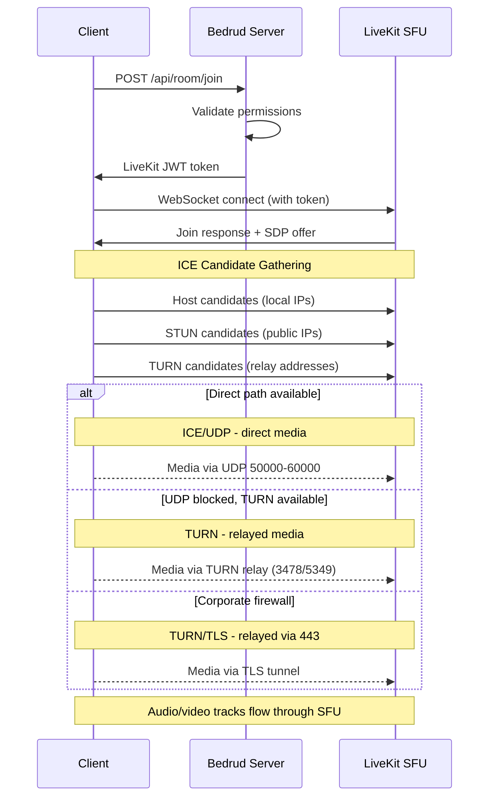
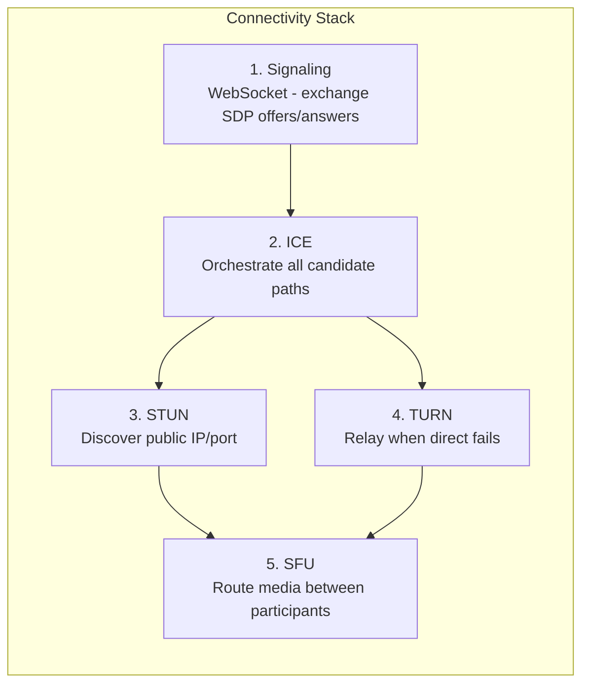
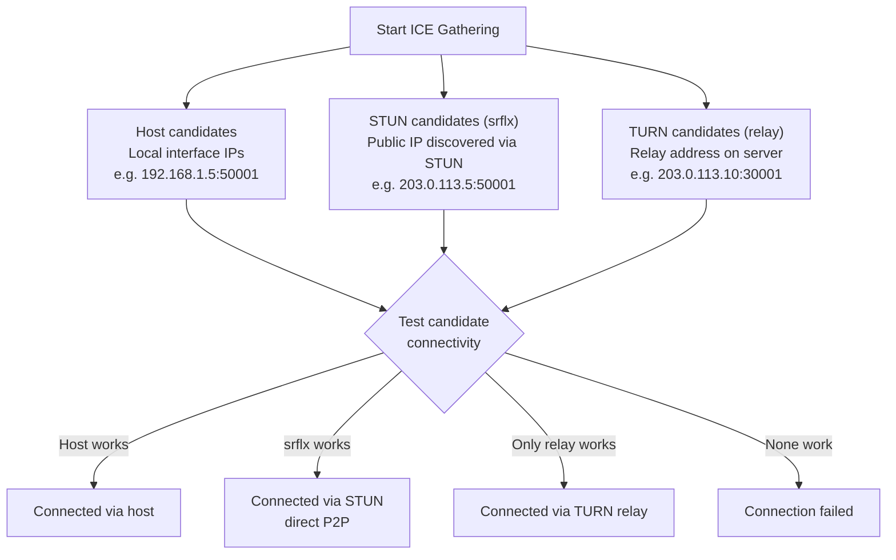
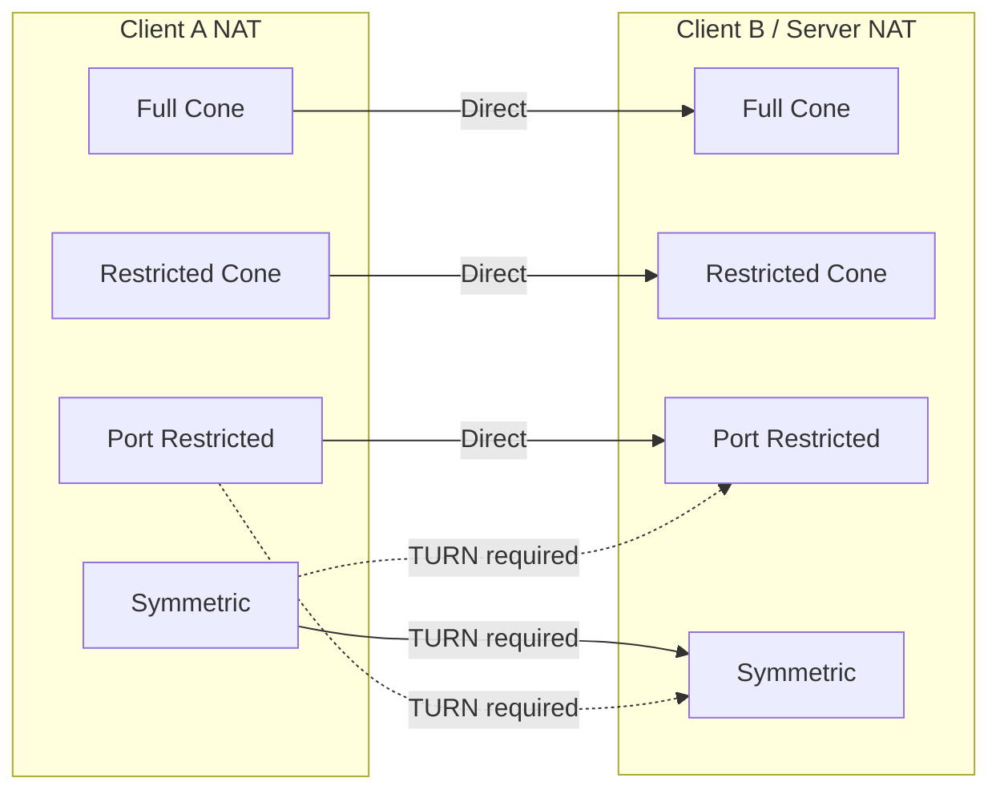

İstemcilerin Bedrud'da gerçek zamanlı medya bağlantılarını nasıl kurduğu. Tam bağlantı yığınını kapsar: sinyalleşme, ICE, STUN, TURN ve SFU medya yolu.

---

## Genel Bakış

WebRTC, ses ve video istemci ile sunucu arasında akmadan önce bir dizi adım gerektirir. Bedrud, LiveKit'in SFU (Selective Forwarding Unit) mimarisini kullanır - istemciler birbirine değil sunucuya bağlanır. **Bu, yalnızca istemciden sunucuya olan ağ yolunun önemli olduğu anlamına gelir**, bireysel katılımcılar arasındaki bağlantı değil.



---

## Bağlantı Yığını

Medya yolunu kurmak için beş katman birlikte çalışır:



### Katman Ayrıntıları

**1. Sinyalleşme** - İstemci ve sunucu WebSocket üzerinden SDP (Session Description Protocol) teklif ve yanıtlarıyla bağlantı üst verilerini takas eder. Bu medya değil, kurulum aşamasıdır. Bedrud sinyalleşmeyi API sunucusu üzerinden gömülü LiveKit örneğine vekil olarak iletir.

**2. ICE (Interactive Connectivity Establishment)** - Aday adı verilen tüm olası bağlantı yollarını toplar ve öncelik sırasına göre sınar. ICE bir çerçevedir - bağlantı girişimlerini koordine eder ama kendisi bir protokol değildir.

**3. STUN (Session Traversal Utilities for NAT)** - Hafif bir protokoldür. İstemci STUN sunucusuna bir bağlama isteği gönderir, sunucu istemcinin genel IP'si ve portu ile yanıt verir. Bu "sunucu yansımalı" aday daha sonra doğrudan bağlantı için sınanır. Bağlantıların ~%80'inde çalışır.

**4. TURN (Traversal Using Relays around NAT)** - Doğrudan bağlantı başarısız olduğunda TURN sunucuda bir aktarma adresi ayırır. Tüm medya paketleri bu aktarma üzerinden iletilir. En yüksek maliyet - sunucu bant genişliği aktarılan kullanıcılarla ölçeklenir. Ayrıntılı bilgi için bkz. [TURN Sunucusu Kılavuzu](turn-server.mdx).

**5. SFU (Selective Forwarding Unit)** - Aktarım yolu kurulduktan sonra LiveKit'in SFU'su katılımcılar arasında medyayı yönlendirir. Her katılımcı bir yayın gönderir; SFU kopyalarını diğer katılımcılara iletir. Bu eşler arası değildir - sunucu her zaman yoldadır.

---

## ICE Aday Toplama



ICE aynı anda üç aday türü toplar:

| Tür | Kaynak | Öncelik | Nasıl çalışır |
|-----|--------|----------|---------------|
| **host** | Yerel ağ arayüzleri | En yüksek | Makineden doğrudan IP. LAN'da çalışır. |
| **srflx** (sunucu yansımalı) | STUN sunucusu yanıtı | Orta | STUN ile keşfedilen genel IP. Çoğu NAT türünde çalışır. |
| **relay** | TURN sunucusu ayırması | En düşük | TURN sunucusundaki adres. Her zaman çalışır. En yüksek maliyet. |

ICE tüm adayları sınar ve başarılı olan en yüksek öncelikli çifti seçer. `srflx` çalışırsa `relay`'i atlar.

---

## NAT Türleri ve Bağlantı

Farklı NAT türleri doğrudan bağlantının çalışıp çalışmadığını etkiler:



| NAT Türü | Açıklama | Doğrudan P2P | TURN Gerekli |
|----------|----------|--------------|-------------|
| **Full Cone** | Aynı iç IP/port'tan gelen tüm istekler aynı genel IP/port'a eşlenir. Herhangi bir dış ana bilgisayar buna gönderebilir. | Evet | Hayır |
| **Restricted Cone** | Full Cone ile aynı eşleme, ancak yalnızca paket almış dış ana bilgisayarlar geri gönderebilir. | Genellikle | Hayır |
| **Port Restricted Cone** | Restricted Cone'a benzer, ancak NAT dış port numarasını da kısıtlar. En yaygın ev yönlendirici türü. | Genellikle | Nadiren |
| **Simetrik** | Hedef başına farklı genel IP/port eşlemesi. STUN ile keşfedilen adres yeniden kullanılamaz. | Hayır (her iki taraf simetrik olduğunda) | **Evet** |

**Temel çıkarım:** Sunucunun genel IP'si ve öngörülebilir port aralığı olduğu için çoğu NAT türü doğrudan çalışır. TURN genellikle istemcinin güvenlik duvarı giden UDP'yi tamamen engellediğinde gerekir.

---

## Yapılandırma Özeti

Hangi Bedrud/LiveKit yapılandırma anahtarları WebRTC bağlantısını etkiler:

**`livekit.yaml` anahtarları:**

```yaml
rtc:
  port_range_start: 50000       # UDP medya port aralığı başlangıcı
  port_range_end: 60000         # UDP medya port aralığı sonu
  tcp_port: 7881                # ICE/TCP yedek portu
  stun_servers:                 # Harici STUN sunucuları (isteğe bağlı)
    - stun:stun.l.google.com:19302
  use_external_ip: true         # ICE adaylarında genel IP'yi duyur

turn:
  enabled: true                 # Gömülü TURN'ü etkinleştir
  domain: "turn.example.com"    # TURN etki alanı (DNS çözümlenmeli)
  udp_port: 3478                # TURN/UDP + STUN portu
  tls_port: 5349                # TURN/TLS portu (veya 443)
  cert_file: /path/to/turn.crt  # TURN/TLS için TLS sertifikası
  key_file: /path/to/turn.key   # TURN/TLS için TLS anahtarı
  relay_range_start: 30000      # Aktarma port aralığı başlangıcı
  relay_range_end: 40000        # Aktarma port aralığı sonu
  external_tls: false           # L4 LB TLS'yi sonlandırır
```

**`config.yaml` anahtarları (Bedrud sunucusu):**

```yaml
server:
  port: 8090                    # API portu (sinyalleşme buradan vekil olarak iletilir)
  enableTLS: true               # Sinyalleşme için HTTPS
  domain: "meet.example.com"    # Genel etki alanı
```

### Bağlantı Sorunlarını Hata Ayıklama

| Belirti | Denetle |
|---------|---------|
| Hiç bağlanamıyor | `rtc.use_external_ip: true` mı? Güvenlik duvarı 443 + UDP aralığında açık mı? |
| Bağlanıyor ama ses/video yok | UDP 50000-60000 engelli mü? Tarayıcıda ICE adaylarını denetle. |
| Yavaş bağlantı | TURN aktarma aktif (adayları denetle). İstemci katı NAT arkasındaysa beklenir. |
| Kurumsal ağda başarısız | TURN/TLS yapılandırılmamış. Geçerli sertifika ile `turn.tls_port: 443` ayarla. |
| LAN'da çalışıyor, uzaktan başarısız | Genel IP duyurulmuyor. `rtc.use_external_ip: true` ayarla. |

TURN sorun giderme detayları için bkz. [TURN Sunucusu Kılavuzu](/tr/docs/architecture/turn-server).

---

## Ayrıca bakınız

- [TURN Sunucusu Kılavuzu](/tr/docs/architecture/turn-server) - TURN mimarisi, yapılandırma, TLS, hata ayıklama
- [LiveKit Entegrasyonu](/tr/docs/backend/livekit) - Bedrud'un LiveKit'i nasıl gömdüğü
- [Mimari Genel Bakış](/tr/docs/architecture/overview) - tam sistem mimarisi
- [İç TLS](/tr/docs/guides/internal-tls) - İzole ağlar için TLS
