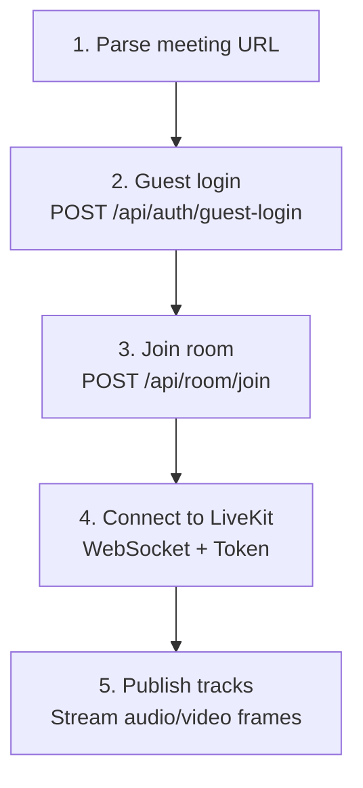
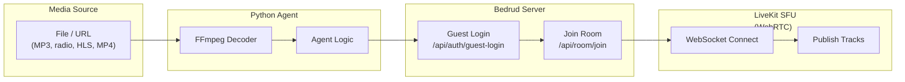

Bedrud 包含基于 Python 的机器人代理，可以加入会议室并流式传输媒体内容。适用于背景音乐、网络广播流或共享视频内容。

## 可用代理

| 代理 | 描述 | 媒体类型 |
|-------|-------------|-----------|
| `music_agent` | 将音频文件播放到房间中 | 音频 (PCM) |
| `radio_agent` | 流式传输网络广播电台 | 音频 (PCM via FFmpeg) |
| `video_stream_agent` | 共享视频内容 (HLS, MP4) | 视频 + 音频 |

## 代理工作原理

所有代理遵循相同的连接模式：





## 音乐代理

将音频文件（MP3、WAV 等）播放到会议室中。

### 设置

```bash
cd agents/music_agent
pip install -r requirements.txt
```

**依赖：** `httpx`、`livekit`、`pydub`

### 使用方法

```bash
python agent.py "https://meet.example.com/m/room-name"
```

### 工作原理

1. 使用 `pydub` 解码音频文件
2. 转换为 PCM 帧
3. 将音频帧作为麦克风轨道发布到 LiveKit

> 请参阅[音乐代理 README](https://github.com/bedrud-ir/bedrud/tree/main/agents/music_agent)获取设置和使用说明。

---

## 广播代理

使用 FFmpeg 进行音频解码，将网络广播电台流式传输到会议室中。

### 设置

```bash
cd agents/radio_agent
pip install -r requirements.txt
```

**依赖：** `httpx`、`livekit`

**系统要求：** 必须安装 FFmpeg（`brew install ffmpeg` 或 `apt install ffmpeg`）

### 使用方法

```bash
python agent.py "https://meet.example.com/m/room-name"
```

### 工作原理

1. 连接到广播流 URL
2. 将流通过 FFmpeg 管道解码为原始 PCM
3. 将 PCM 音频帧发布到 LiveKit

> 请参阅[广播代理 README](https://github.com/bedrud-ir/bedrud/tree/main/agents/radio_agent)获取设置和使用说明。

---

## 视频流代理

将来自 URL（HLS/m3u8、MP4）的视频和音频共享到会议室中。

### 设置

```bash
cd agents/video_stream_agent
pip install -r requirements.txt
```

**依赖：** `httpx`、`livekit`

**系统要求：** 必须安装 FFmpeg

### 使用方法

```bash
python agent.py "https://meet.example.com/m/room-name"
```

### 工作原理

1. 并行运行两个 FFmpeg 进程：
    - **视频：** 解码为 YUV420p 原始帧（1280x720 @ 30fps）
    - **音频：** 解码为 PCM 采样
2. 将视频作为屏幕共享轨道发布
3. 将音频作为麦克风轨道发布

> 请参阅[视频流代理 README](https://github.com/bedrud-ir/bedrud/tree/main/agents/video_stream_agent)获取设置和使用说明。

### 视频规格

| 设置 | 值 |
|---------|-------|
| 宽度 | 1280 |
| 高度 | 720 |
| 帧率 | 30 |
| 像素格式 | YUV420p |

---

## 编写自定义代理

要创建新代理，请遵循以下模式：

```python
import httpx
from livekit import rtc

# 1. Parse the meeting URL to extract room name
room_name = parse_url(meeting_url)

# 2. Guest login
client = httpx.Client(base_url=server_url)
resp = client.post("/api/auth/guest-login", json={"name": "Bot Name"})
token = resp.json()["token"]

# 3. Join room
client.headers["Authorization"] = f"Bearer {token}"
resp = client.post("/api/room/join", json={"roomName": room_name})
lk_token = resp.json()["token"]

# 4. Connect to LiveKit
room = rtc.Room()
await room.connect(livekit_url, lk_token)

# 5. Publish tracks
source = rtc.AudioSource(sample_rate=48000, num_channels=1)
track = rtc.LocalAudioTrack.create_audio_track("audio", source)
await room.local_participant.publish_track(track)

# 6. Stream frames
while has_data:
    frame = get_next_frame()
    await source.capture_frame(frame)
```

---

## 另请参阅

- [音乐代理 README](https://github.com/bedrud-ir/bedrud/tree/main/agents/music_agent) - 设置和使用
- [广播代理 README](https://github.com/bedrud-ir/bedrud/tree/main/agents/radio_agent) - 设置和使用
- [视频流代理 README](https://github.com/bedrud-ir/bedrud/tree/main/agents/video_stream_agent) - 设置和使用
