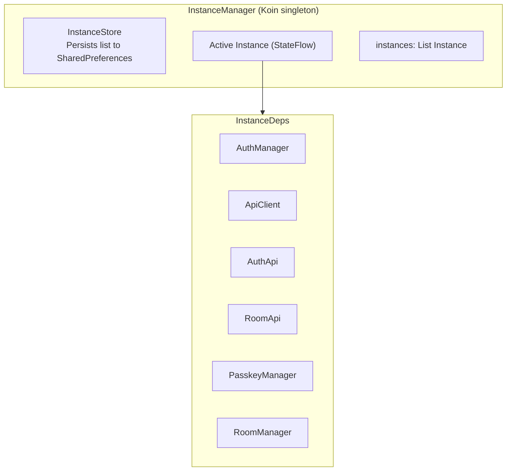
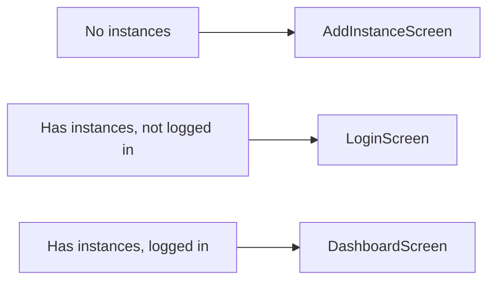

Bedrud Android 应用使用 Jetpack Compose 和 Kotlin 构建，提供原生视频会议体验，支持画中画、深度链接和多实例。

## 技术栈

| 技术 | 版本 | 用途 |
|-----------|---------|---------|
| Kotlin | 2.1.0 | 语言 |
| Jetpack Compose | Material 3 | UI 工具包 |
| Koin | 4.0.0 | 依赖注入 |
| Retrofit + OkHttp | Latest | HTTP 客户端 |
| LiveKit Android SDK | 2.23.3 | WebRTC 媒体 |
| Credentials API | Latest | Passkey 支持 |
| Encrypted SharedPreferences | Latest | 安全存储 |
| Coil | Latest | 图片加载 |

**目标：** 最低 SDK 28，目标 SDK 35，JDK 17

## 目录结构

```
apps/android/app/src/main/java/com/bedrud/app/
├── BedrudApplication.kt           # Application class (Koin init)
├── MainActivity.kt                # Single-activity entry point
├── core/
│   ├── api/                       # Retrofit API client
│   │   ├── ApiClient.kt           # Base HTTP client with auth interceptor
│   │   ├── AuthApi.kt             # Auth endpoint definitions
│   │   └── RoomApi.kt             # Room endpoint definitions
│   ├── auth/
│   │   └── AuthManager.kt         # Token management, login/logout
│   ├── call/
│   │   ├── CallService.kt         # Foreground service for calls
│   │   └── CallConnectionService.kt  # Android ConnectionService
│   ├── deeplink/
│   │   └── DeepLinkHandler.kt     # Handle bedrud.com deep links
│   ├── di/
│   │   └── AppModule.kt           # Koin module definitions
│   ├── instance/
│   │   ├── InstanceManager.kt     # Central multi-instance orchestrator
│   │   ├── InstanceStore.kt       # Persistent instance storage
│   │   └── InstanceDeps.kt        # Per-instance dependency container
│   ├── livekit/
│   │   └── RoomManager.kt         # LiveKit room connection manager
│   └── pip/
│       └── PipManager.kt          # Picture-in-Picture controller
├── models/
│   ├── User.kt                    # User data model
│   ├── Room.kt                    # Room data model
│   ├── Instance.kt                # Server instance model
│   └── ApiResponse.kt             # API response wrappers
└── ui/
    ├── screens/
    │   ├── auth/
    │   │   ├── LoginScreen.kt     # Email/password + passkey login
    │   │   └── RegisterScreen.kt  # Account registration
    │   ├── dashboard/
    │   │   └── DashboardScreen.kt # Room list and management
    │   ├── meeting/
    │   │   └── MeetingScreen.kt   # Video call interface
    │   ├── instance/
    │   │   ├── AddInstanceScreen.kt    # Add server instance
    │   │   └── InstanceSwitcher.kt     # Switch between instances
    │   ├── profile/
    │   │   └── ProfileScreen.kt   # User profile
    │   └── settings/
    │       └── SettingsScreen.kt  # App settings
    ├── components/                 # Reusable Compose components
    └── theme/                      # Material 3 theme definition
```

## 多实例架构

Android 应用支持同时连接到多个 Bedrud 服务器。



### 关键模式

所有每个实例的依赖项以 `StateFlow<T?>` 的形式暴露在 `InstanceManager` 上。Composable 函数通过 collect 收集它们：

```kotlin
val authManager = instanceManager.authManager.collectAsState().value ?: return
val roomApi = instanceManager.roomApi.collectAsState().value ?: return
```

`?: return` 模式确保 composable 在实例完全初始化之前不会渲染。

### 导航流程



实例切换器作为从仪表板工具栏触发的 `ModalBottomSheet` 出现。

## 功能

### 深度链接

应用处理匹配以下 URL：

- `https://bedrud.com/m/*` - 直接加入房间
- `https://bedrud.com/c/*` - 通过房间代码加入

通过 `AndroidManifest.xml` 中的 intent filter 配置。

### 通话管理

- **CallService** - 通话期间保持连接活跃的前台服务
- **CallConnectionService** - 与 Android 电话框架集成以提供正确的通话界面
- 所需权限：`MANAGE_OWN_CALLS`、`FOREGROUND_SERVICE_PHONE_CALL`、`FOREGROUND_SERVICE_CAMERA`、`FOREGROUND_SERVICE_MICROPHONE`

### 画中画

会议界面支持画中画模式，允许用户在使用其他应用时查看视频画面。

### Passkey

使用 Android 的 Credentials API 进行 FIDO2/WebAuthn Passkey 注册和登录。

## 构建

```bash
# Debug APK
make build-android-debug

# Release APK (requires keystore.properties)
make build-android

# Build + install on connected device
make release-android

# Open in Android Studio
make dev-android
```

### 发布签名

发布构建需要在 android 项目根目录中有一个 `keystore.properties` 文件，包含签名配置。
