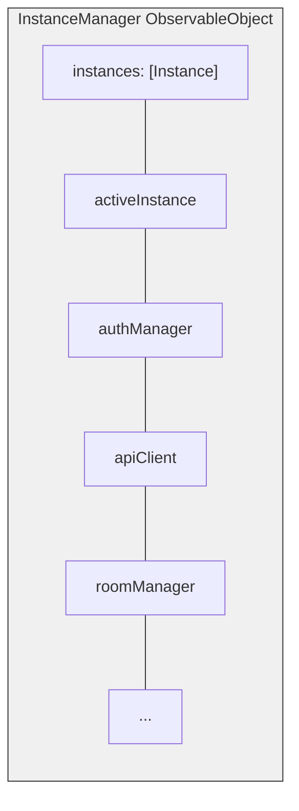
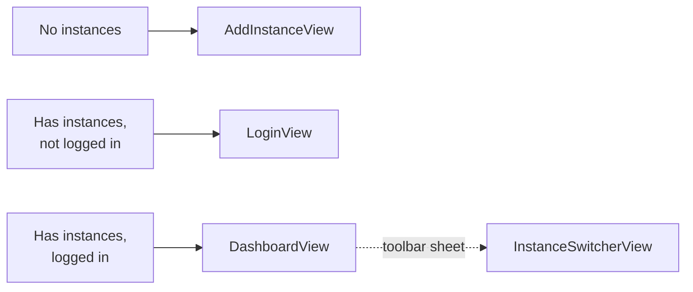

Bedrud iOS 应用使用 SwiftUI 构建，提供原生视频会议体验，支持多实例和安全凭证存储。

## 技术栈

| 技术 | 版本 | 用途 |
|-----------|---------|---------|
| Swift | 5.9+ | 语言 |
| SwiftUI | Latest | UI 框架 |
| LiveKit Swift SDK | 2.0+ | WebRTC 媒体 |
| KeychainAccess | 4.2.2+ | 安全凭证存储 |

**部署目标：** iOS 18.0

## 项目配置

项目使用 **XCodeGen** 从 `project.yml` 生成项目：

- Bundle ID：`com.bedrud.ios`
- 生成命令：`xcodegen generate`

## 目录结构

```text
apps/ios/Bedrud/
├── BedrudApp.swift                # App entry point
├── Core/
│   ├── API/
│   │   └── APIClient.swift        # URLSession-based REST client
│   ├── Auth/
│   │   └── AuthManager.swift      # Token management, login/logout
│   ├── Instance/
│   │   ├── InstanceManager.swift  # Central multi-instance orchestrator
│   │   └── InstanceStore.swift    # Persistent instance storage (UserDefaults)
│   └── LiveKit/
│       └── RoomManager.swift      # LiveKit room connection manager
├── Features/
│   ├── Auth/
│   │   ├── LoginView.swift        # Login screen
│   │   └── RegisterView.swift     # Registration screen
│   ├── Dashboard/
│   │   └── DashboardView.swift    # Room list and management
│   ├── Meeting/
│   │   └── MeetingView.swift      # Video call interface
│   ├── Profile/
│   │   └── ProfileView.swift      # User profile
│   ├── Instance/
│   │   ├── AddInstanceView.swift  # Add server instance
│   │   └── InstanceSwitcherView.swift  # Switch between instances
│   ├── Settings/
│   │   └── SettingsView.swift     # App settings
│   ├── JoinByURL/
│   │   └── JoinByURLView.swift    # Deep link handling
│   └── Main/
│       └── MainTabView.swift      # Tab navigation
├── Models/
│   ├── User.swift
│   ├── Room.swift
│   └── Instance.swift
└── Design/
    └── Components/                # Reusable SwiftUI components
```

## 多实例架构

iOS 应用在多实例支持方面镜像了 Android 架构。



### 关键模式

依赖项是 `InstanceManager` 上的 `@Published` 属性，而 `InstanceManager` 是一个 `ObservableObject`。视图通过 `@EnvironmentObject` 接收它：

```swift
struct DashboardView: View {
    @EnvironmentObject var instanceManager: InstanceManager

    var body: some View {
        if let authManager = instanceManager.authManager {
            // Render authenticated UI
        }
    }
}
```

### 导航流程



实例切换器作为从仪表板工具栏触发的 `.sheet` 出现。

## 应用入口

`BedrudApp.swift` 初始化核心服务并将它们注入到 SwiftUI 环境中：

```swift
@main
struct BedrudApp: App {
    @StateObject var instanceStore = InstanceStore()
    @StateObject var instanceManager = InstanceManager()
    @StateObject var settingsStore = SettingsStore()

    var body: some Scene {
        WindowGroup {
            ContentView()
                .environmentObject(instanceStore)
                .environmentObject(instanceManager)
                .environmentObject(settingsStore)
        }
    }
}
```

## 功能

### 安全存储

使用 **KeychainAccess** 存储 JWT 令牌和敏感凭证，而非 UserDefaults。

### 深度链接

处理用于直接加入房间和房间代码的 URL。

### 设置

用户偏好通过 `SettingsStore` 使用 UserDefaults 持久化。

## 构建

```bash
# Open in Xcode
make dev-ios

# Build archive (Release)
make build-ios

# Export IPA (requires ExportOptions.plist)
make export-ios

# Build for simulator (Debug)
make build-ios-sim
```

### 要求

- Xcode（最新稳定版）
- iOS 18.0 部署目标
- 设备构建：Apple Developer 账户和配置描述文件
