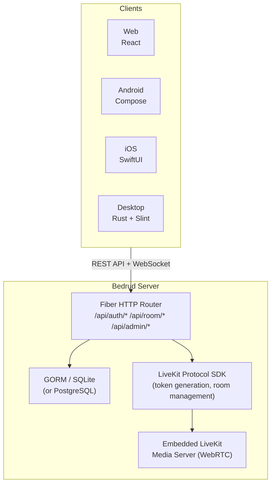
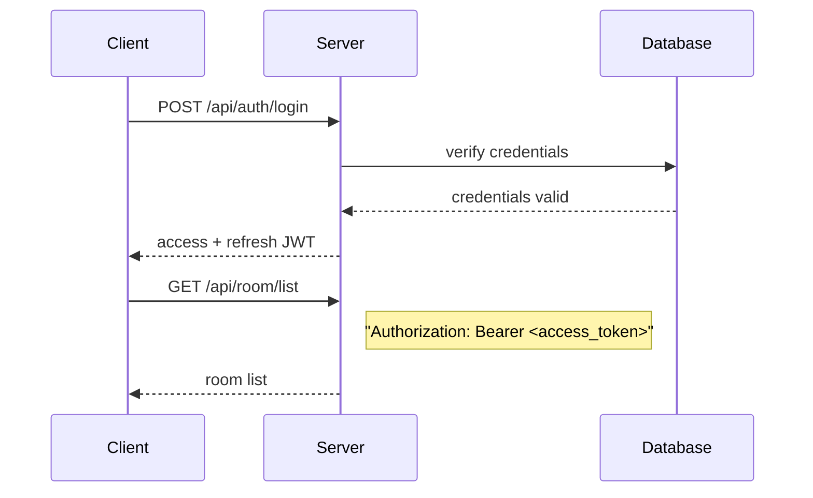
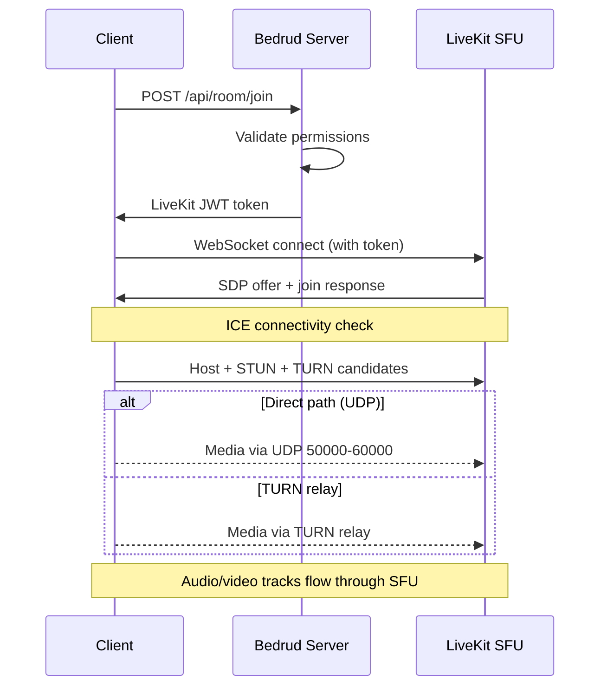

Bedrud 是一个 monorepo，包含 Go 服务器、三个客户端应用、Python 机器人代理和共享包。本页描述各组件之间的关系。

## 架构总览

## 组件

### 服务器 (`server/`)

Go 后端是 Bedrud 的核心。它负责处理：

- **REST API** - 认证、房间管理、管理操作
- **静态文件服务** - 编译后的 Web 前端通过 `//go:embed` 嵌入
- **LiveKit 集成** - 通过 LiveKit Protocol SDK 生成令牌并管理房间
- **嵌入式 LiveKit 服务器** - 媒体服务器二进制文件作为子进程运行

服务器使用 **Fiber** Web 框架（类似于 Node.js 的 Express.js）和 **GORM** 作为 ORM 层。开发环境支持 SQLite，生产环境支持 PostgreSQL。

详情请参阅[服务器架构](/zh/docs/architecture/server)。

### Web 前端 (`apps/web/`)

一个基于 TanStack Start、TailwindCSS v4 和 shadcn/ui 构建的 **React** 应用。在生产环境中，它在服务器端预渲染，客户端资源被嵌入到 Go 二进制文件中。

主要功能：

- 基于 LiveKit Client SDK 的视频会议界面
- 基于 JWT 的认证，支持自动令牌刷新
- 用户和房间管理的管理后台
- 具有一致组件库的设计系统

详情请参阅 [Web 前端](/zh/docs/architecture/web)。

### Android 应用 (`apps/android/`)

使用 **Jetpack Compose** 和 **Kotlin** 构建的原生 Android 应用。使用 Koin 进行依赖注入，使用 Retrofit 进行 HTTP 请求。

主要功能：

- 基于 LiveKit Android SDK 的完整视频会议体验
- 画中画模式
- 深度链接处理（`bedrud.com/m/*` 和 `bedrud.com/c/*`）
- 通过 Android ConnectionService 进行通话管理
- 多实例支持（连接到多个服务器）

详情请参阅 [Android 应用](/zh/docs/architecture/android)。

### iOS 应用 (`apps/ios/`)

使用 **SwiftUI** 构建的原生 iOS 应用。使用 KeychainAccess 进行安全凭证存储，使用 LiveKit Swift SDK 处理媒体。

主要功能：

- 完整的视频会议体验
- 多实例支持
- 深度链接处理
- 基于 Keychain 的安全存储

详情请参阅 [iOS 应用](/zh/docs/architecture/ios)。

### 桌面应用 (`apps/desktop/`)

使用 **Rust** 和 **Slint** UI 工具包构建的原生 Windows 和 Linux 桌面应用。编译为单个二进制文件，无运行时依赖。

主要功能：

- 通过 LiveKit Rust SDK 提供完整的视频会议体验
- 原生 Windows（Direct3D 11）和 Linux（OpenGL/Vulkan）渲染
- 多实例支持（连接到多个 Bedrud 服务器）
- 操作系统密钥环集成，用于安全凭证存储

详情请参阅[桌面应用](/zh/docs/architecture/desktop)。

### 机器人代理 (`agents/`)

以机器人身份加入会议室并流式传输媒体内容的 Python 脚本：

- **音乐代理** - 播放音频文件
- **广播代理** - 流式传输网络广播电台
- **视频流代理** - 共享视频内容（HLS、MP4）

详情请参阅[机器人代理](/zh/docs/architecture/agents)。

## 认证流程

所有认证请求在 `Authorization` 请求头中使用 JWT 令牌。Web 前端的 `authFetch` 封装器负责令牌附加和自动刷新。

支持的认证方式：

| 方式 | 端点 | 描述 |
|--------|----------|-------------|
| 邮箱/密码 | `POST /api/auth/login` | 传统凭证认证 |
| 注册 | `POST /api/auth/register` | 创建新账户 |
| 访客 | `POST /api/auth/guest-login` | 仅需名称即可临时访问 |
| OAuth | `GET /api/auth/:provider/login` | Google、GitHub、Twitter |
| Passkey | `POST /api/auth/passkey/*` | FIDO2/WebAuthn 生物识别 |

## 会议连接流程

1. 客户端通过 REST API 请求加入房间
2. 服务器验证权限并生成签名的 LiveKit 令牌
3. 客户端使用令牌通过 WebSocket 直接连接到 LiveKit
4. ICE 收集候选者（host、STUN、TURN）并选择最佳路径
5. 音视频轨道通过 LiveKit 的 SFU 传输

完整的连接堆栈请参阅 [WebRTC 连接](/zh/docs/architecture/webrtc-connectivity)。

## 数据模型

### 用户

| 字段 | 类型 | 描述 |
|-------|------|-------------|
| ID | uint | 主键 |
| Email | string | 唯一邮箱地址 |
| Name | string | 显示名称 |
| Password | string | 哈希密码（OAuth/访客为空） |
| Avatar | string | 头像 URL |
| Provider | string | 认证提供商（`local`、`google`、`github`、`twitter`、`guest`） |
| Role | string | `user` 或 `admin` |

### 房间

| 字段 | 类型 | 描述 |
|-------|------|-------------|
| ID | uint | 主键 |
| AdminID | uint | 外键 → User.ID（房间创建者） |
| Name | string | 房间名称 / URL slug |
| IsPublic | bool | 访客是否可以无需邀请加入 |
| ChatEnabled | bool | 房间内聊天是否启用 |
| VideoEnabled | bool | 是否允许视频 |
| Participants | []User | 当前在房间中的用户 |

### Passkey

| 字段 | 类型 | 描述 |
|-------|------|-------------|
| ID | uint | 主键 |
| UserID | uint | 外键 → User.ID |
| CredentialID | []byte | WebAuthn 凭证 ID |
| PublicKey | []byte | WebAuthn 公钥 |
| Counter | uint32 | WebAuthn 签名计数 |

### RefreshToken

| 字段 | 类型 | 描述 |
|-------|------|-------------|
| Token | string | 刷新令牌字符串 |
| UserID | uint | 外键 → User.ID |
| ExpiresAt | time | 令牌过期时间戳 |

## 部署架构

在生产环境中，Bedrud 以两个 systemd 服务运行：

| 服务 | 二进制 | 用途 |
|---------|--------|---------|
| `bedrud.service` | `bedrud --run` | API 服务器 + 嵌入式 Web 前端 |
| `livekit.service` | `bedrud --livekit` | WebRTC 媒体服务器 |

两者由同一个二进制文件管理。Traefik 或其他反向代理负责 TLS 终止和流量路由。

设置说明请参阅[部署指南](/zh/docs/guides/deployment)。

## 关键术语

以下术语出现在整个架构文档中：

| 术语 | 全称 | 含义 |
|------|-----------|---------|
| **SFU** | Selective Forwarding Unit | 一种媒体服务器，接收每个参与者的流并将其转发给其他人。客户端连接到服务器，而非彼此之间直接连接。 |
| **SDP** | Session Description Protocol | 用于描述 WebRTC 连接参数（编解码器、分辨率、媒体类型）的格式。 |
| **ICE** | Interactive Connectivity Establishment | 一个收集客户端和服务器之间所有可能网络路径，然后选择最佳路径的框架。 |
| **STUN** | Session Traversal Utilities for NAT | 一种轻量级协议，帮助客户端发现其公共 IP 地址。适用于大多数连接。 |
| **TURN** | Traversal Using Relays around NAT | 当直接连接不可行时，通过服务器中继所有媒体的协议。最后手段，带宽成本最高。 |
| **NAT** | Network Address Translation | 路由器功能，将私有内部地址映射为公共地址。根据类型可能阻止直接 WebRTC 连接。 |
| **srflx** | Server Reflexive | 一种 ICE 候选者类型，代表客户端的公共 IP，通过 STUN 发现。 |
| **WebRTC** | Web Real-Time Communication | 用于实时音频、视频和数据传输的浏览器和移动端 API 标准。 |

## 另请参阅

- [WebRTC 连接](/zh/docs/architecture/webrtc-connectivity) - 完整的 STUN/ICE/TURN/SFU 连接堆栈
- [TURN 服务器指南](/zh/docs/architecture/turn-server) - TURN 中继架构和配置
- [LiveKit 集成](/zh/docs/backend/livekit) - Bedrud 如何嵌入 LiveKit
