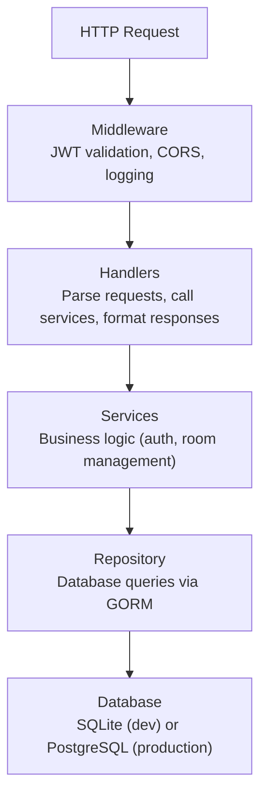

Bedrud 服务器是一个 Go 应用程序，提供 REST API、服务嵌入式 Web 前端，并管理 LiveKit 媒体服务器。

## 技术栈

| 技术 | 用途 |
|-----------|---------|
| Go 1.24 | 核心语言 |
| Fiber v2 | Web 框架（类似 Express） |
| GORM | 用于 SQLite 和 PostgreSQL 的 ORM |
| LiveKit Protocol SDK | WebRTC 房间和令牌管理 |
| Zerolog | 结构化 JSON 日志 |
| Goth | 多提供商 OAuth2 |
| go-passkeys | FIDO2/WebAuthn 支持 |
| golang-jwt | JWT 令牌创建和验证 |
| gocron | 后台任务调度 |
| Swagger (swaggo) | API 文档生成 |

## 目录结构

```
server/
├── cmd/
│   ├── server/main.go        # Development entry point
│   └── bedrud/main.go        # Production entry point (with install/livekit flags)
├── internal/
│   ├── auth/                  # Authentication services
│   │   ├── auth.go            # Core auth service (register, login, OAuth)
│   │   ├── jwt.go             # JWT token creation and validation
│   │   └── session_store.go   # Gorilla session store for OAuth state
│   ├── database/              # Database initialization and migrations
│   ├── handlers/              # HTTP request handlers (controller layer)
│   │   ├── auth_handler.go    # Auth endpoints
│   │   ├── room.go            # Room endpoints
│   │   └── users.go           # User management endpoints
│   ├── middleware/             # Fiber middleware
│   │   └── auth.go            # JWT validation, permission checks
│   ├── models/                # GORM models (database schemas)
│   │   ├── user.go            # User model
│   │   ├── room.go            # Room model
│   │   └── passkey.go         # Passkey model
│   ├── repository/            # Data access layer (SQL via GORM)
│   │   ├── user_repository.go
│   │   ├── room_repository.go
│   │   └── passkey_repository.go
│   ├── livekit/               # Embedded LiveKit server management
│   ├── scheduler/             # Background job scheduling
│   └── utils/                 # TLS and other utilities
├── frontend/                  # Embedded web frontend (populated at build time)
├── config.yaml                # Development configuration
├── livekit.yaml               # Development LiveKit configuration
├── go.mod
└── go.sum
```

## 分层架构

服务器遵循三层架构：



## 关键模式

### 嵌入式前端

Web 前端编译为静态文件，并通过 `//go:embed` 嵌入到 Go 二进制文件中：

```go
//go:embed frontend/*
var frontendFS embed.FS
```

在构建时，`bun run build:embed` SSR 预渲染 React 应用并将 `dist/client/` 复制到 `server/frontend/`。然后 Go 编译器将其打包到二进制文件中。Fiber 服务器为所有非 API 路由提供这些文件。

### JWT 认证

中间件从 `Authorization: Bearer <token>` 请求头中提取 JWT，进行验证，并将用户上下文附加到请求中。受保护的路由使用 `RequireAccess` 中间件检查用户角色。

### LiveKit 令牌生成

当用户加入房间时，服务器：

1. 验证房间权限
2. 创建使用 API 密钥签名的 LiveKit 访问令牌
3. 将令牌返回给客户端
4. 客户端使用令牌直接连接到 LiveKit

### Swagger 文档

API 文档通过 swaggo 从代码注释自动生成。在开发环境中，可通过 `/api/swagger/` 访问。

## 数据库

### SQLite（默认）

在开发和小规模部署中，Bedrud 使用 SQLite。数据库文件存储在配置的 `database.path`（默认：`data.db`）中。

### PostgreSQL

对于需要更高并发能力的生产环境，可配置 PostgreSQL 连接字符串。GORM 透明处理两种数据库方言。

### 迁移

GORM 在启动时根据模型结构体自动迁移数据库模式。模型定义在 `internal/models/` 中。

## 后台任务

`gocron` 调度器运行定期任务，例如：
- 清理过期的刷新令牌
- 移除过期的房间参与者

---

## 另请参阅

- [后端代码结构](/zh/docs/backend/structure) - 目录映射和编码规范
- [API 处理器](/zh/docs/backend/api-handlers) - 路由和请求生命周期
- [数据库和模型](/zh/docs/backend/database) - GORM 模型和仓储模式
- [认证流程](/zh/docs/backend/authentication) - JWT、OAuth 和 Passkey 内部实现
