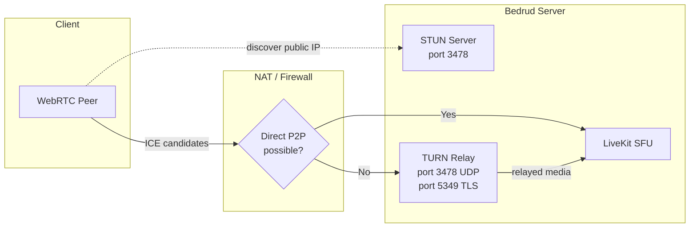
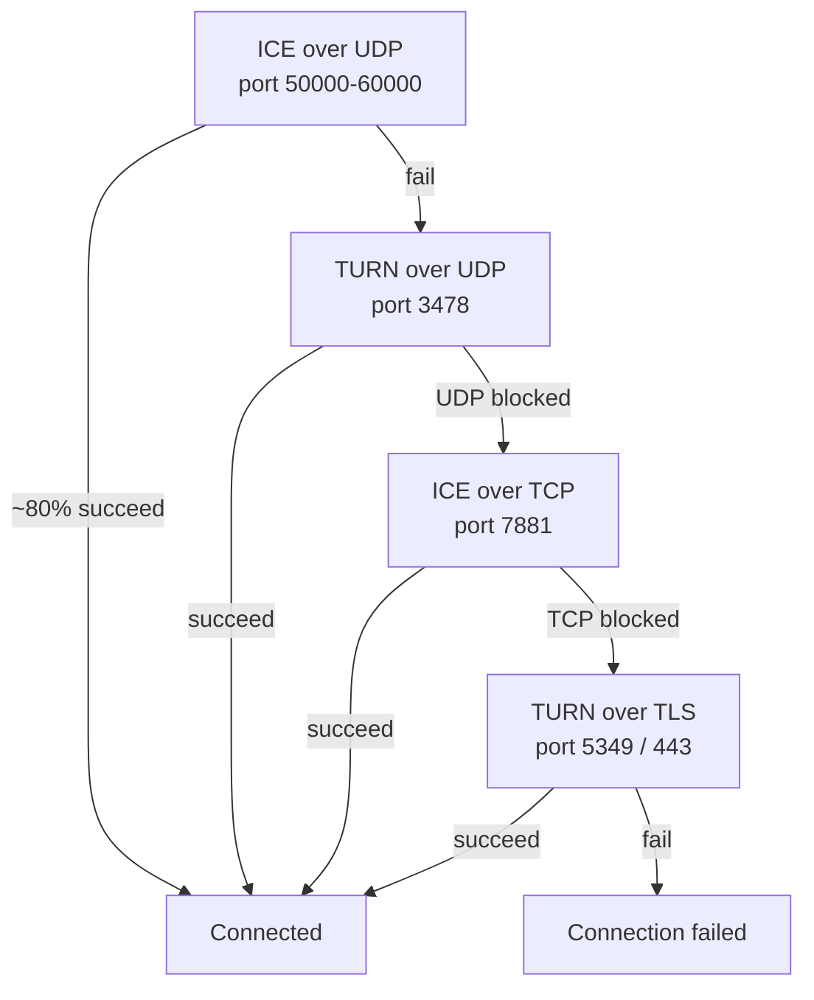
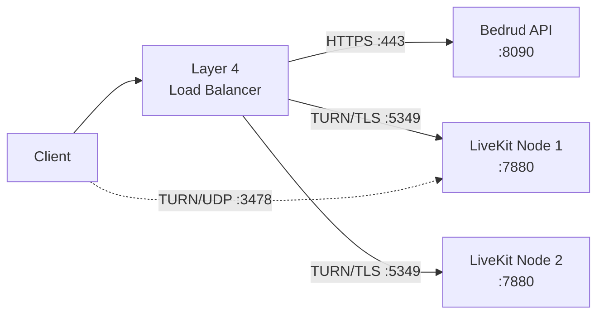
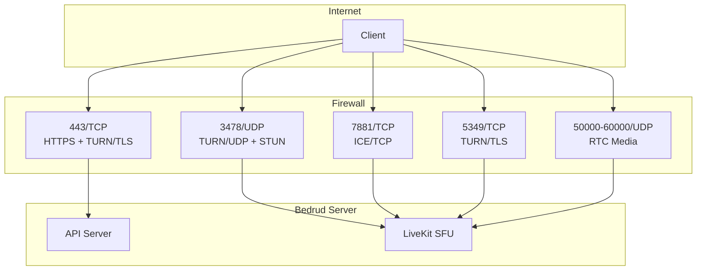

Bedrud 通过 LiveKit 嵌入 TURN 服务器，为处于限制性 NAT 或防火墙后的客户端中继媒体。本页涵盖架构、配置和故障排除。

---

## 什么是 TURN

**TURN**（NAT 中继遍历）是一种协议，当两个端点无法直接连接时，通过服务器转发媒体数据包。

**相关协议：**

| 协议 | 角色 | 成本 |
|----------|------|------|
| **STUN** | 发现公共 IP/端口。轻量级。 | 无（服务器仅看到小型绑定请求） |
| **ICE** | 按优先级顺序尝试所有连接选项的框架。 | 无（仅协调） |
| **TURN** | 当直接路径失败时中继所有媒体。最后手段。 | 高（服务器带宽 = 所有中继媒体） |

完整的连接堆栈请参阅 [WebRTC 连接](/zh/docs/architecture/webrtc-connectivity)。

---

## Bedrud 中的 TURN

LiveKit 包含一个嵌入式 TURN 服务器。无需外部基础设施。

### 中继架构



### 连接优先级

LiveKit 按顺序尝试连接类型。每个回退都会增加延迟和服务器成本：



| 优先级 | 类型 | 端口 | 典型场景 |
|----------|------|------|-----------------|
| 1 | ICE/UDP（直接） | 50000-60000 | 大多数连接。无中继。 |
| 2 | TURN/UDP | 3478 | 对称型 NAT，P2P 被阻止。 |
| 3 | ICE/TCP | 7881 | UDP 被阻止（VPN、某些防火墙）。 |
| 4 | TURN/TLS | 5349 或 443 | 企业防火墙，仅允许 HTTPS 出站。 |

---

## TURN 何时激活

TURN 在直接媒体路径失败时激活。常见原因：

- **双方均为对称型 NAT** - 客户端和服务器都有对称型 NAT。NAT 为每个目标分配不同的公共端口，因此 STUN 发现的地址变得不可达。
- **企业防火墙** - 完全阻止出站 UDP。仅允许 TCP 443。
- **VPN 限制** - 某些 VPN 拦截或阻止 WebRTC 流量。
- **没有公共 IP 的云虚拟机** - 某些云提供商使用的 NAT 会破坏直接 ICE。

大多数用户（约 80%）不会触发 TURN。直接 UDP 路径有效。

### 带宽成本

当 TURN 中继时，服务器承载该参与者的所有媒体。每个流的近似带宽：

| 流类型 | 比特率 | 每个中继参与者 |
|-------------|---------|------------------------|
| 音频 (Opus) | ~32 Kbps | ~32 Kbps |
| 视频 720p (VP8) | ~1.5 Mbps | ~1.5 Mbps 上行 + 每个订阅轨道 1.5 Mbps 下行 |
| 屏幕共享 1080p | ~2.5 Mbps | ~2.5 Mbps |

对于有 1 个中继参与者的 5 人会议：服务器为该参与者的视频中继处理约 1.5 Mbps 额外带宽。将这些值乘以中继参与者数量以估算总服务器带宽。

---

## 配置

**文件：** `server/config/livekit.yaml`（开发环境）或 `/etc/bedrud/livekit.yaml`（生产环境）

```yaml
turn:
  enabled: true
  domain: "turn.example.com"
  udp_port: 3478
  tls_port: 5349
  cert_file: /etc/bedrud/turn.crt
  key_file: /etc/bedrud/turn.key
  relay_range_start: 30000
  relay_range_end: 40000
  external_tls: false
```

### 关键参考

| 键 | 默认值 | 描述 |
|-----|---------|-------------|
| `enabled` | `true` | 启用嵌入式 TURN 服务器。 |
| `domain` | `localhost` | 向客户端广播的域名。必须解析到服务器的公共 IP。 |
| `udp_port` | `3478` | TURN/UDP 端口。启用 TURN 时也处理 STUN 绑定请求。 |
| `tls_port` | `5349` | TURN/TLS 端口。如果没有负载均衡器终止 TLS，设为 `443`。 |
| `cert_file` | - | TURN/TLS 的 TLS 证书。当存在 TURN/TLS 客户端时必需。 |
| `key_file` | - | 与 `cert_file` 匹配的 TLS 私钥。 |
| `relay_range_start` | `30000` | 用于中继媒体数据包的 UDP 端口范围起始。 |
| `relay_range_end` | `40000` | 中继端口范围结束。每个中继参与者从此范围消耗端口。 |
| `external_tls` | `false` | 当四层负载均衡器终止 TURN/TLS 时设为 `true`。LiveKit 跳过 TURN 端口上的自身 TLS。 |

### `use_external_ip` 交互

在同一个 `livekit.yaml` 中，`rtc:` 下：

```yaml
rtc:
  use_external_ip: true
```

必须为 `true` TURN 才能正常工作。当为 `false` 时，ICE 候选者包含内部（私有）IP 地址，互联网上的客户端无法访问。

---

## 生产环境 TLS 设置

TURN/TLS 需要自己的 TLS 证书。两种方式：

### 单域名（无负载均衡器）

复用服务器的 TLS 证书。将 `tls_port` 设为 `443`：

```yaml
turn:
  enabled: true
  domain: "meet.example.com"
  tls_port: 443
  cert_file: /etc/bedrud/meet.example.com.crt
  key_file: /etc/bedrud/meet.example.com.key
```

TURN 域名和服务器域名相同。端口 443 同时处理 HTTPS API 和 TURN/TLS - LiveKit 通过协议区分。

### 专用 TURN 域名（带负载均衡器）



```yaml
turn:
  enabled: true
  domain: "turn.example.com"
  tls_port: 5349
  external_tls: true
```

负载均衡器终止 TLS。`external_tls: true` 告诉 LiveKit 期望已解密的流量。

---

## 端口与防火墙参考



| 端口 | 协议 | 服务 | 必需 | 备注 |
|------|----------|---------|----------|-------|
| 443 | TCP | HTTPS + TURN/TLS | 是 | API + Web UI。如果 `tls_port: 443` 也用于 TURN/TLS。 |
| 3478 | UDP | TURN/UDP + STUN | 推荐 | 双用途：STUN 绑定 + TURN 中继。 |
| 5349 | TCP | TURN/TLS | 如果无 LB | 专用 TURN/TLS 端口。使用端口 443 时可跳过。 |
| 7881 | TCP | ICE/TCP | 推荐 | UDP 被阻止但不需要 TLS 时的回退。 |
| 50000-60000 | UDP | RTC 媒体 | 是 | ICE 候选者端口。每个参与者使用 2 个端口。 |
| 7880 | TCP | LiveKit API | 内部 | WebSocket 信令。生产环境中不直接暴露。 |

### 最低防火墙规则

基本连接所需：

```
Allow TCP 443    (HTTPS + TURN/TLS)
Allow UDP 3478   (TURN/UDP + STUN)
Allow UDP 50000-60000  (RTC media)
```

最大兼容性（企业网络）：

```
Also allow TCP 7881  (ICE/TCP)
Also allow TCP 5349  (TURN/TLS, if not using port 443)
```

---

## 测试与调试

### 浏览器：chrome://webrtc-internals

1. 在加入会议前在 Chrome/Edge 中打开 `chrome://webrtc-internals`。
2. 创建一个 dump。
3. 在 Stats 选项卡中查找 **ICE candidate pairs**。
4. 候选者类型告诉你连接路径：

| 候选者类型 | 含义 |
|---------------|---------|
| `host` | 本地 IP。直接接口。 |
| `srflx`（服务器反射） | STUN 发现的公共 IP。直接 P2P 工作中。 |
| `relay` | TURN 中继激活。媒体通过服务器传输。 |

如果你看到 `relay` 候选者为活动对，则 TURN 正在处理该连接。

### LiveKit Client SDK 事件

所有 LiveKit SDK 发出连接状态事件：

```typescript
room.on(RoomEvent.Connected, () => {
  console.log("Connected");
});

room.on(RoomEvent.Reconnecting, () => {
  console.log("Connection lost, reconnecting...");
});
```

检查 `room.localParticipant.connectionQuality` 获取连接统计。

### LiveKit 服务器日志

在 `livekit.yaml` 中增加日志级别到 debug：

```yaml
logging:
  level: debug
```

查找包含以下内容的日志条目：
- `ICE` - 候选者收集状态
- `TURN` - 中继分配事件
- `relay` - 活跃中继连接

### 使用 turnutils 手动测试 TURN

安装 `coturn-utils` 包，然后测试 TURN 连接：

```bash
turnutils_uclient -t -p 3478 -W devkey -u devkey turn.example.com
```

- `-t` - 使用 TCP
- `-p` - TURN 端口
- 将凭证替换为生产环境值

成功输出显示已分配的中继地址。

---

## 故障排除

| 症状 | 可能原因 | 修复 |
|---------|-------------|-----|
| 客户端无法连接，超时 | TURN 端口被防火墙阻止 | 开放 UDP 3478、TCP 5349、UDP 50000-60000 |
| TURN/TLS 失败 | TLS 证书缺失或不匹配 | 验证 `cert_file`/`key_file` 路径。检查证书是否匹配 `domain`。 |
| 带负载均衡器时 TURN/TLS 失败 | `external_tls` 未设置 | 在配置中设置 `external_tls: true`。 |
| 单向音视频 | 中继端口范围被阻止 | 开放 `relay_range_start` 到 `relay_range_end` 的 UDP。 |
| 服务器带宽高 | 许多 NAT 后面的客户端使用中继 | 正常。扩展服务器或减少中继用户。 |
| 有 `relay` 候选者但期望 `srflx` | `use_external_ip: false` | 设置 `rtc.use_external_ip: true`。 |
| TURN 域名无法解析 | DNS 配置错误 | `dig +short turn.example.com` 必须返回服务器的公共 IP。 |
| 企业防火墙后的客户端 | 仅允许端口 443 | 设置 `turn.tls_port: 443`。确保证书有效。 |
| `turn.enabled: true` 但没有中继 | 直接路径有效（好事） | TURN 是回退。没有中继 = 更好。通过 `chrome://webrtc-internals` 验证。 |

### 快速诊断清单

1. `dig +short <turn.domain>` 返回正确的公共 IP？
2. 防火墙允许 UDP 3478、TCP 5349、UDP 50000-60000？
3. `tls_port: 443` 或 `5349` 与防火墙规则匹配？
4. `cert_file` 和 `key_file` 存在且可读？
5. 证书的 CN/SAN 匹配 `turn.domain`？
6. `rtc.use_external_ip: true` 已设置？
7. LiveKit 日志中没有 TURN 相关错误？

---

## 另请参阅

- [WebRTC 连接](/zh/docs/architecture/webrtc-connectivity) - 完整的 STUN/ICE/TURN/SFU 连接堆栈
- [LiveKit 集成](/zh/docs/backend/livekit) - Bedrud 如何嵌入 LiveKit
- [配置参考](/zh/docs/getting-started/configuration) - 所有配置选项
- [内部 TLS](/zh/docs/guides/internal-tls) - 隔离网络的 TLS
- [部署指南](/zh/docs/guides/deployment) - 生产环境部署步骤
