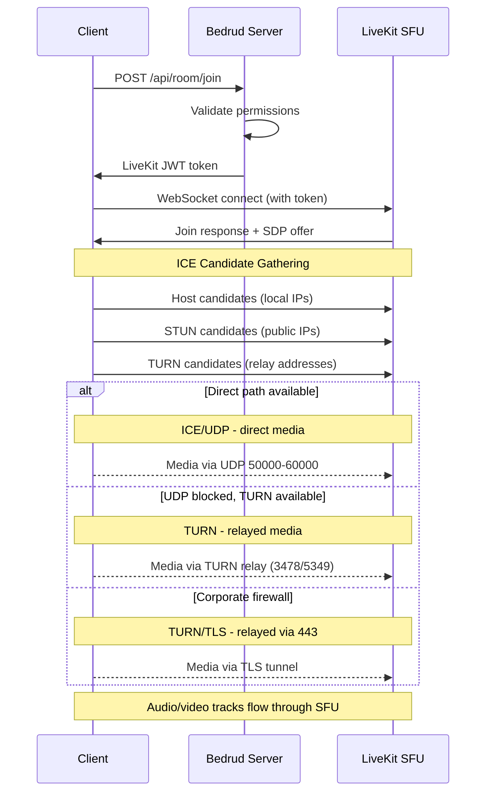
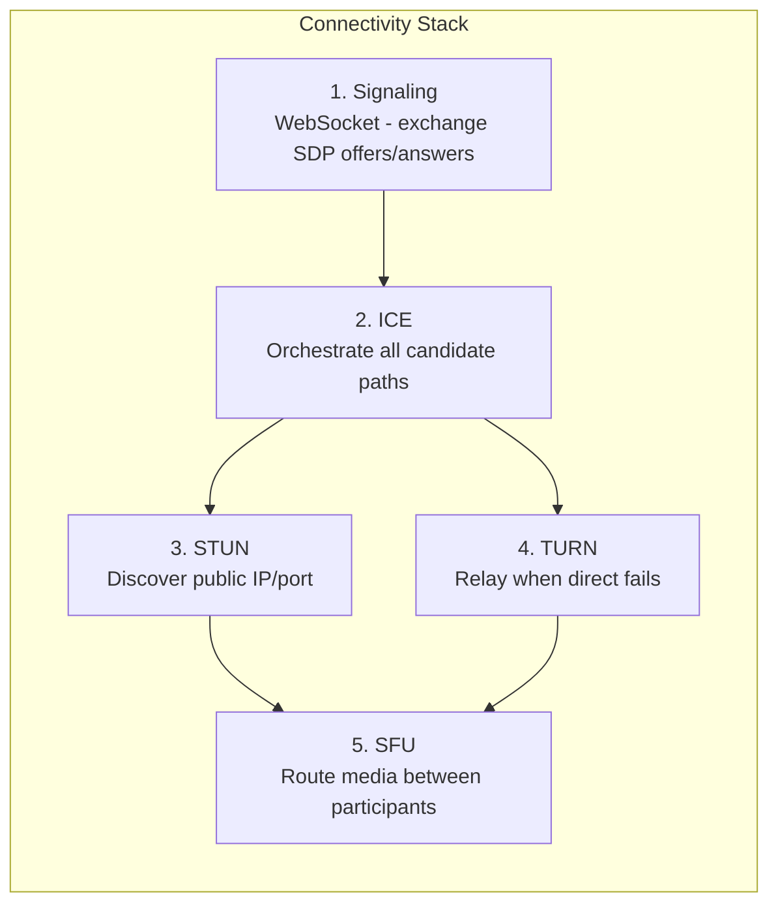
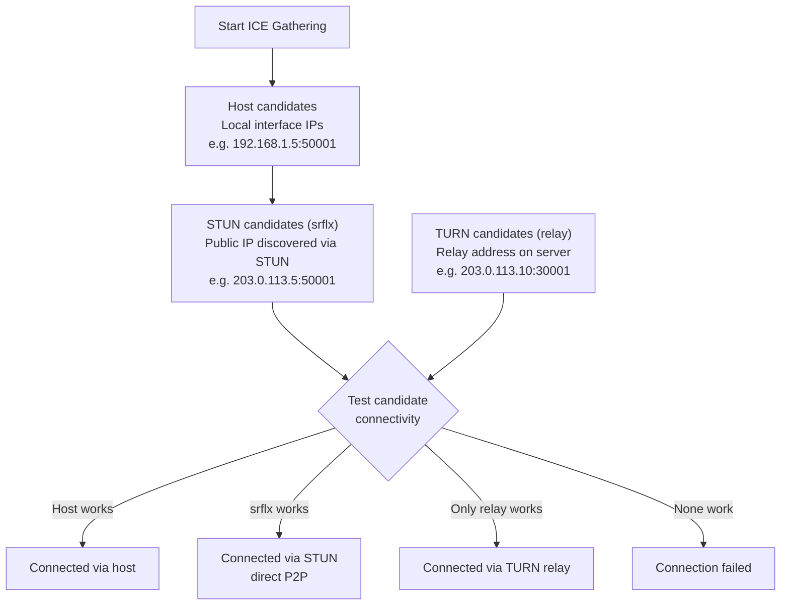
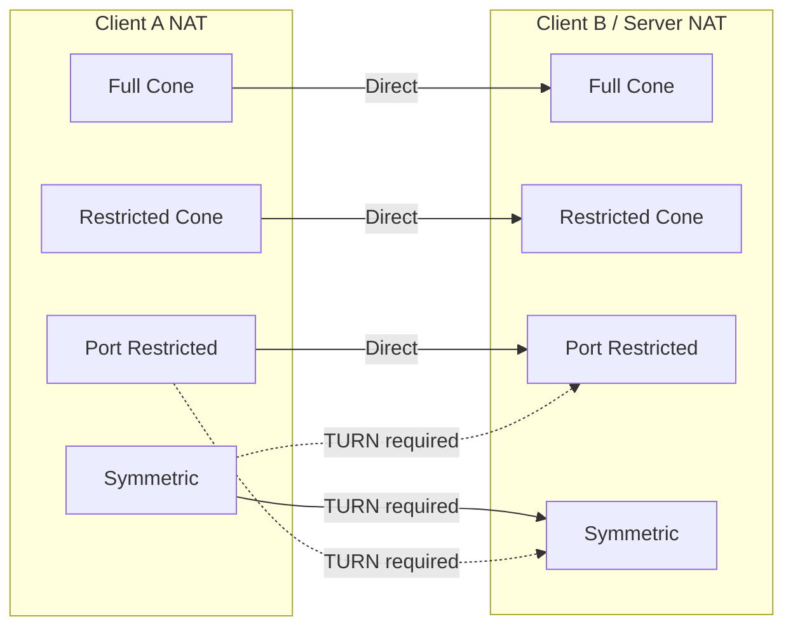

客户端在 Bedrud 中如何建立实时媒体连接。涵盖完整的连接堆栈：信令、ICE、STUN、TURN 和 SFU 媒体路径。

---

## 概述

WebRTC 需要一系列步骤才能在客户端和服务器之间传输音频和视频。Bedrud 使用 LiveKit 的 SFU（选择性转发单元）架构 - 客户端连接到服务器，而非彼此之间直接连接。**这意味着只有客户端到服务器的网络路径是重要的**，而非各个参与者之间的连接。



---

## 连接堆栈

五层协同工作以建立媒体路径：



### 各层详情

**1. 信令** - 客户端和服务器通过 WebSocket 使用 SDP（会话描述协议）offer 和 answer 交换连接元数据。这不是媒体 - 它是设置阶段。Bedrud 通过 API 服务器将信令代理到嵌入式 LiveKit 实例。

**2. ICE（交互式连接建立）** - 收集所有可能的连接路径（称为候选者），并按优先级顺序测试它们。ICE 是一个框架 - 它协调连接尝试，但本身不是协议。

**3. STUN（NAT 会话遍历实用工具）** - 轻量级协议。客户端向 STUN 服务器发送绑定请求，服务器响应客户端的公共 IP 和端口。这个"服务器反射"候选者随后被测试是否可以直接连接。适用于约 80% 的连接。

**4. TURN（NAT 中继遍历）** - 当直接连接失败时，TURN 在服务器上分配一个中继地址。所有媒体数据包通过此中继转发。成本最高 - 服务器带宽随中继用户数量线性增长。详见 [TURN 服务器指南](turn-server.mdx)。

**5. SFU（选择性转发单元）** - 一旦传输路径建立，LiveKit 的 SFU 在参与者之间路由媒体。每个参与者向上发送一个流；SFU 将副本转发给其他参与者。这不是点对点 - 服务器始终在路径中。

---

## ICE 候选者收集



ICE 同时收集三种候选者类型：

| 类型 | 来源 | 优先级 | 工作方式 |
|------|--------|----------|-------------|
| **host** | 本地网络接口 | 最高 | 来自机器的直接 IP。在局域网内有效。 |
| **srflx**（服务器反射） | STUN 服务器响应 | 中等 | 通过 STUN 发现的公共 IP。适用于大多数 NAT 类型。 |
| **relay** | TURN 服务器分配 | 最低 | TURN 服务器上的地址。始终有效。成本最高。 |

ICE 测试所有候选者并选择成功的最高优先级对。如果 `srflx` 有效，则跳过 `relay`。

---

## NAT 类型与连接

不同的 NAT 类型影响直接连接是否可行：



| NAT 类型 | 描述 | 直接 P2P | 需要 TURN |
|----------|-------------|------------|-----------|
| **完全锥形** | 来自相同内部 IP/端口的所有请求映射到相同的公共 IP/端口。任何外部主机都可以发送数据。 | 是 | 否 |
| **受限锥形** | 与完全锥形相同，但只有收到过数据包的外部主机才能回发。 | 通常 | 否 |
| **端口受限锥形** | 类似受限锥形，但 NAT 还限制外部端口号。最常见的家庭路由器类型。 | 通常 | 很少 |
| **对称型** | 每个目标使用不同的公共 IP/端口映射。STUN 发现的地址无法复用。 | 否（双方都对称时） | **是** |

**关键洞察：** 由于服务器有公共 IP 和可预测的端口范围，大多数 NAT 类型可以直接工作。TURN 主要在客户端防火墙完全阻止出站 UDP 时才需要。

---

## 配置摘要

哪些 Bedrud/LiveKit 配置键影响 WebRTC 连接：

**`livekit.yaml` 键：**

```yaml
rtc:
  port_range_start: 50000       # UDP media port range start
  port_range_end: 60000         # UDP media port range end
  tcp_port: 7881                # ICE/TCP fallback port
  stun_servers:                 # External STUN servers (optional)
    - stun:stun.l.google.com:19302
  use_external_ip: true         # Advertise public IP in ICE candidates

turn:
  enabled: true                 # Enable embedded TURN
  domain: "turn.example.com"    # TURN domain (DNS must resolve)
  udp_port: 3478                # TURN/UDP + STUN port
  tls_port: 5349                # TURN/TLS port (or 443)
  cert_file: /path/to/turn.crt  # TLS cert for TURN/TLS
  key_file: /path/to/turn.key   # TLS key for TURN/TLS
  relay_range_start: 30000      # Relay port range start
  relay_range_end: 40000        # Relay port range end
  external_tls: false           # L4 LB terminates TLS
```

**`config.yaml` 键 (Bedrud 服务器)：**

```yaml
server:
  port: 8090                    # API port (signaling proxied through this)
  enableTLS: true               # HTTPS for signaling
  domain: "meet.example.com"    # Public domain
```

### 连接问题排查

| 症状 | 检查 |
|---------|-------|
| 完全无法连接 | `rtc.use_external_ip: true`？防火墙是否开放 443 + UDP 范围？ |
| 已连接但无音视频 | UDP 50000-60000 被阻止？检查浏览器中的 ICE 候选者。 |
| 连接缓慢 | TURN 中继激活（检查候选者）。客户端处于严格 NAT 后面时属正常。 |
| 在企业网络中失败 | TURN/TLS 未配置。设置 `turn.tls_port: 443` 并使用有效证书。 |
| 局域网正常，远程失败 | 公共 IP 未广播。设置 `rtc.use_external_ip: true`。 |

深入了解 TURN 故障排除，请参阅 [TURN 服务器指南](/zh/docs/architecture/turn-server)。

---

## 另请参阅

- [TURN 服务器指南](/zh/docs/architecture/turn-server) - TURN 架构、配置、TLS、调试
- [LiveKit 集成](/zh/docs/backend/livekit) - Bedrud 如何嵌入 LiveKit
- [架构概览](/zh/docs/architecture/overview) - 完整系统架构
- [内部 TLS](/zh/docs/guides/internal-tls) - 隔离网络的 TLS
