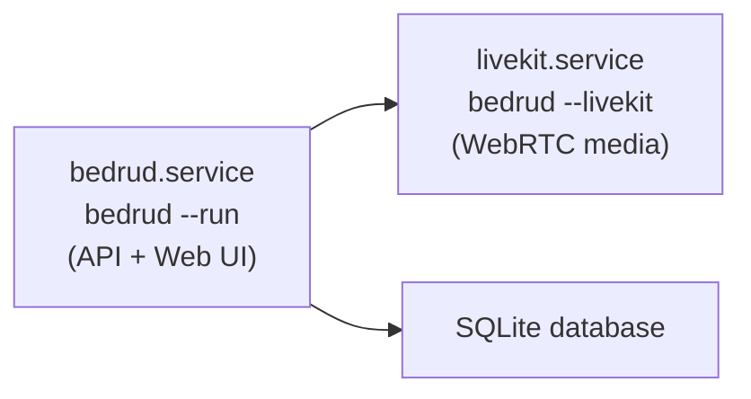

Bedrud 被设计为一个自包含的视频会议"一体机"。单个可执行二进制文件打包了所需的一切 - 前端、后端和 LiveKit 媒体服务器。

## 核心特性

| 特性 | 说明 |
|---------|-------------|
| 零外部依赖 | 不需要 Node.js、Redis 或独立的媒体服务器 |
| 嵌入式媒体服务器 | LiveKit 二进制文件已包含并自动管理 |
| 嵌入式前端 | React UI 已编译并通过 SSR 预渲染到 Go 二进制文件中 |
| SQLite 存储 | 不需要数据库服务器 |
| 内置 TLS | 自签名证书或 Let's Encrypt |
| 内置安装程序 | 自动配置 systemd、目录和配置文件 |

## 运行二进制文件

### 启动 Bedrud 服务器

```bash
./bedrud --run --config config.yaml
```

### 启动 LiveKit 媒体服务器

```bash
./bedrud --livekit --config livekit.yaml
```

该二进制文件同时包含 API 服务器和媒体服务器。使用标志来选择启动哪个。

## 安装

### 快速安装（Debian/Ubuntu）

```bash
# With Let's Encrypt TLS
sudo ./bedrud install --tls --domain meet.example.com --email admin@example.com

# With self-signed certificate
sudo ./bedrud install --tls --ip 1.2.3.4

# Plain HTTP (dev only)
sudo ./bedrud install --ip 1.2.3.4
```

<InstallerSteps />

### 服务架构

安装后，会运行两个 systemd 服务：



## 配置文件

| 文件 | 用途 |
|------|---------|
| `/etc/bedrud/config.yaml` | 主服务器配置 |
| `/etc/bedrud/livekit.yaml` | 媒体服务器配置 |
| `/var/lib/bedrud/bedrud.db` | SQLite 数据库 |
| `/var/log/bedrud/bedrud.log` | 应用日志 |

所有选项请参阅[配置参考](/zh/docs/getting-started/configuration)。

## 安装后

### 创建第一个管理员

<CreateAdmin />

### 查看服务状态

```bash
systemctl status bedrud livekit
```

### 查看日志

```bash
tail -f /var/log/bedrud/bedrud.log
journalctl -u bedrud -f
```

## 卸载

```bash
sudo ./bedrud uninstall
```

这将完全删除：

- Systemd 服务文件
- `/usr/local/bin/` 中的二进制文件
- `/etc/bedrud/` 中的配置
- `/var/lib/bedrud/` 中的数据
- `/var/log/bedrud` 中的日志
